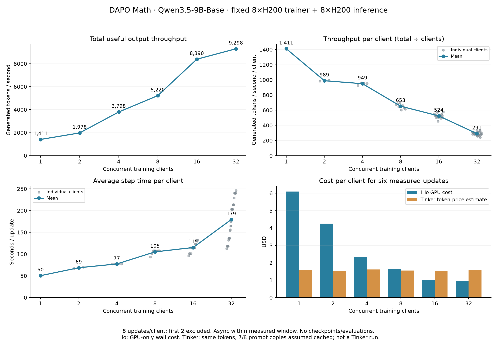
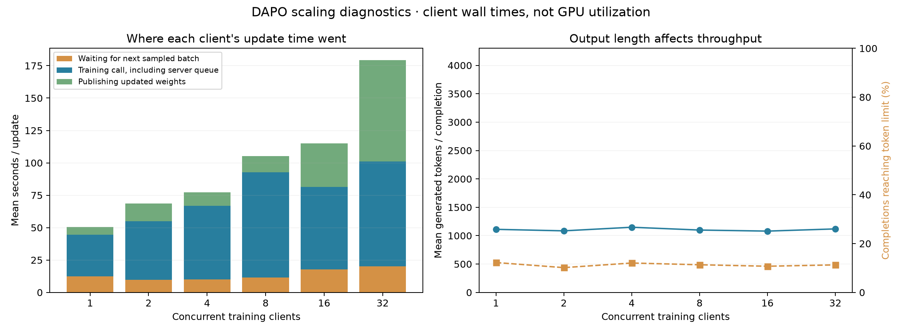

# DAPO Math: concurrent LoRA client scaling

This experiment measures Qwen3.5-9B-Base through Lilo's Miles training backend as 1, 2, 4, 8, 16 and 32 independent RL clients share one 8×H200 trainer and eight single-H200 inference replicas. GPU capacity and workload settings stay fixed as client count increases.

## Results

**16 clients was a useful middle ground in this short sweep.** It delivered 8,390 output tokens/s, 90% of the 9,298 tokens/s at 32 clients. Doubling from 16 to 32 raised total throughput by 11%, reduced per-client throughput from 524 to 291 tokens/s, and increased mean step time from 115 to 179 seconds. The highest aggregate TPS was at 32; no interior throughput peak was observed.



| Clients | Total output TPS | TPS/client | Mean step (s) | Lilo GPU cost/client | Tinker estimate/client |
|---:|---:|---:|---:|---:|---:|
| 1 | 1,411 | 1,411 | 50.4 | $6.10 | $1.57 |
| 2 | 1,978 | 989 | 68.6 | $4.25 | $1.53 |
| 4 | 3,798 | 949 | 77.3 | $2.34 | $1.62 |
| 8 | 5,220 | 653 | 105.1 | $1.63 | $1.55 |
| 16 | 8,390 | 524 | 115.1 | $1.00 | $1.53 |
| 32 | 9,298 | 291 | 179.4 | $0.93 | $1.58 |

Costs cover six measured updates per client. At 16 clients, GPU cost was $2.40/million output tokens including training, versus a $3.68 Tinker estimate. At 32 clients, those figures were $2.17 and $3.67. These are GPU-only costs and token-price estimates, not invoice totals or a measured Tinker run.

At 32 clients, completing the six measured updates took individual clients between 11.3 and 24.6 minutes. Mean update time included 80.9 seconds in training calls, 78.4 seconds publishing weights, and 20.1 seconds waiting for the next sampled batch. Publication includes time waiting behind other trainer work. The creation-order scheduler described below helps explain why later clients took much longer; the chart is a measurement of the current implementation, not an inference or trainer hardware ceiling.



All 504 optimizer updates across 63 clients succeeded; 378 updates enter the measured results. Every reported point finished and drained before the next point started.

Download the [summary CSV](assets/dapo-client-scaling/summary.csv), [summary and per-client JSON](assets/dapo-client-scaling/summary.json), [main figure PDF](assets/dapo-client-scaling/sweep.pdf), or [diagnostic PDF](assets/dapo-client-scaling/diagnostics.pdf). The [artifact directory](assets/dapo-client-scaling) also contains every update record, GPU lifetimes and observations, isolation checks, original source manifests, and records of the discarded attempts.

## Workload

Each client performs eight optimizer updates. An update contains eight DAPO Math prompts with eight sampled answers each: 64 sequences, temperature 1, a 4,096-token output limit and a 16,384-token context limit. The model, plain-text prompt format, 320-row dataset, learning rate and group size match the earlier 12-client DAPO cost experiment. That earlier experiment used a different GPU allocation; it is not a hardware-matched baseline for this sweep.

Clients run independently. Each client generates its next batch while its current batch trains, with at most two optimizer updates of policy lag. It sends the forward/backward and optimizer requests together, then publishes weights for subsequent sampling. The last update does not publish unused weights. There are no checkpoints, evaluations, discarded groups or unused batches generated after the eighth update. This is the same numeric-answer, group-mean-centered importance-sampling training loop used for the prior throughput experiment, not a claim to reproduce every algorithmic feature of the DAPO paper.

| Setting | Fixed value |
|---|---|
| Model | Qwen/Qwen3.5-9B-Base |
| Training | 8×H200, tensor parallelism 8 |
| Trainer adapter capacity | 32 clients; LoRA rank 32, alpha 32 |
| Training microbatch token budget | 114,688 |
| Activation recomputation | Full, one layer at a time |
| Inference | 8 replicas, 1×H200 each; no autoscaling |
| SGLang request limits per replica | 128 running, 256 queued |
| Inference adapter limits per replica | 16 GPU slots, 128 loaded CPU adapters |
| Inference memory fraction | 0.8 |
| Learning rate | 0.00001 |
| Miles revision | `ef3807c0ef659d7c6d8494c4933bd7ee0332700f` |

## Measurement and isolation

The first two updates are warmup. After every client finishes those updates and its pending sampling requests, a single barrier starts the measured interval. Updates 3–8 have no cross-client barriers. The interval ends when the last client's eighth update completes. The interval includes filling and draining the asynchronous workload, request overhead, grading, trainer waits and weight publication.

- **Total TPS** = all output tokens used by measured updates ÷ shared elapsed seconds.
- **Per-client TPS** = total TPS ÷ client count. Raw results also include each client's own completion time and throughput.
- **Mean step time** = average time between consecutive update completions for every client. The first measured update starts at the warmup boundary.
- **Training TPS** = prompt-plus-output training input tokens ÷ the same elapsed seconds, accounting for the one-token target shift per sequence. It is reported separately; inference and training tokens are not added together and called useful output TPS.

The gray dots show individual clients in the per-client TPS and step-time panels; the blue line shows their mean. Each client's TPS dot uses the same shared elapsed window, so differences there reflect completed token counts. The step-time dots also show differences in how long clients took to finish their six updates.

Every point starts new trainer and inference apps with different deployment IDs. The supervisor stops both apps after the point and requires two consecutive empty container listings before starting the next point. Resource observations verify one 8-GPU trainer and eight single-GPU inference replicas throughout the measured interval. Placement checks verify that every client uses the same trainer process before and after measurement. The analysis refuses incomplete runs, overlapping runs, reused deployments, inconsistent token counts, or changes to workload code and GPU settings. The only allowed code difference is the CPU driver's preemption setting, described below; original hashes are retained for every run.

The four-client driver's CPU container was preempted during initial model creation, before the trainer finished loading. Its unused adapter was explicitly unloaded during warmup; it had never published weights for sampling. A saved recovery receipt confirms that exactly the four intended clients remained before the measured interval. The trainer and all eight inference replicas remained the same throughout measurement.

Two 16-client attempts were discarded after preemption, one during the measured window and one when its CPU driver restarted during warmup. Both apps were stopped after each attempt, and two empty container listings confirmed cleanup before its replacement started. Failed attempts are excluded from throughput and measured-window cost; their startup and retry expense is not included in the cost comparison.

For the completed 16- and 32-client points, the CPU driver uses `nonpreemptible=True`. The earlier completed points used Modal's default preemptible driver. This changes CPU placement only: the same 16-CPU/32-GiB driver runs identical workload code against unchanged GPU allocations and settings. Modal applies a [3× CPU/RAM price multiplier](https://modal.com/docs/guide/preemption) to this option. CPU/RAM charges are excluded from the GPU-only comparison for every point. The source comparison permits exactly this one decorator argument and rejects other workload changes.

## Cost calculation

The Lilo figure is **GPU cost during the measured interval**, including idle time for all 16 provisioned GPUs. It is not a complete Modal invoice: CPU, RAM, storage, cold starts, the two warmup updates and shutdown are excluded. At the [published Modal H200 price](https://modal.com/pricing) of $0.001261/GPU-second, this fixed allocation costs $0.020176/second, or $72.6336/hour.

Tinker is a **token-price estimate for these exact token counts**, not a measured Tinker run. [Tinker's published Qwen3.5-9B-Base prices](https://tinker-docs.thinkingmachines.ai/tinker/models/) are $1.463/million training tokens, $1.995/million output tokens, $0.66/million uncached prompt tokens and $0.132/million cached prompt tokens (checked September 18, 2026). Training counts include prompt tokens even when their loss is masked.

The primary estimate assumes one uncached prompt copy and seven cached copies for each group of eight completions. Actual Tinker caching is unmeasured. The raw summary also provides a no-prompt-cache estimate. Both sides count the same six updates and their sampling work; neither includes evaluation or discarded generations. Per-client cost is the total divided by the number of clients: an average share of the experiment cost, not a proposed billing policy for individual tenants.

## Limits of this experiment

Six measured updates per client are enough for a short scaling comparison, not a precise long-run capacity estimate. Output lengths, truncation, request placement and shared-server contention can vary. There is only one completed run per client count, so the chart has no confidence intervals. Two warmup updates remove initial startup work but cannot guarantee every later kernel shape is already compiled. The fixed eight-replica inference pool deliberately exposes underutilization at small client counts. Faster clients finishing before slower ones also leaves capacity idle at the end of this short run.

These measurements show useful work completed per second. They do not directly measure GPU kernel utilization or prove which individual GPU operation is the bottleneck. Client wait, training-call and publication times are included in the summary to help interpret the scaling curve; training-call time includes server-side queuing. Publication time likewise includes waiting for the trainer to capture the updated weights, as well as persistence and the response; it is not a direct disk-write duration.

The 32-client run exposed uneven progress on the training/publication path. A saved [queue observation](assets/dapo-client-scaling/queue-observation-32.json) shows that every client had submitted its first measured training call while early clients were several updates ahead of later clients. The current [trainer scheduler](../src/lilo/engine/server.py#L652) scans clients in creation order and selects the first ready operation, batching compatible forward/backward work when possible. It does not rotate the starting client between selections. This can delay later clients' optimizer or publication calls while earlier clients continue submitting work. The client loop is asynchronous, but these results should not be interpreted as the maximum throughput achievable with a fairer scheduler. The scheduler implementation stayed the same across this sweep.

## Reproduce

Use this checkout with the existing Modal model-assets, secrets and provider environment configured. The runner uses `kailash-dev` and expects `lilo-api` and `lilo-proxy`; it does not require a Tinker account or Datadog credentials.
The plotting script additionally requires `matplotlib` and `numpy` in the local Python environment.

```bash
PYTHONPATH=src:scripts OTEL_SDK_DISABLED=true python scripts/run_dapo_client_sweep.py \
  --prefix dapo-my-sweep --counts 1 2 4 8 16 32

python scripts/collect_dapo_sweep_lifetimes.py \
  scripts/results/dapo-client-sweep/dapo-my-sweep-c{01,02,04,08,16,32}

python scripts/analyze_dapo_client_sweep.py \
  scripts/results/dapo-client-sweep/dapo-my-sweep-c{01,02,04,08,16,32} \
  --output docs/assets/dapo-client-scaling
```

The point supervisor enforces fresh apps and a full stop between points. Do not run two copies of the driver in the same checkout: it rewrites the provider's experiment ID to give every inference pool a distinct name. The source hashes saved before each point record exactly what ran.

The tested Lilo runtime is based on commit `c64087c11fc5d080f360397da53cc061dbdfb83c`, with the benchmark provider and runner in this change. Runtime source hashes are checked across all reported points.
