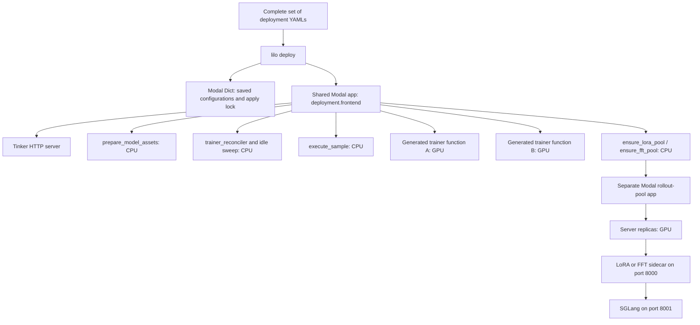

# YAML deployments

This draft implements an opt-in YAML path for shared Modal deployments. A file specifies the base model, trainer backend, resources, context length, adapter capacity, and inference settings. Adding a backend-supported model does not require a new Python definition or a catalog entry.

The implementation has CPU tests. No applications have been redeployed and no GPU compatibility or capacity tests have been run for this change. The existing Python deployment and scoped-run paths remain available.

## The provider and Modal app structure

Start with [`yaml_apps.py`](../src/lilo/providers/modal/yaml_apps.py). It contains the two generic builders and the trainer entrypoint:

```python
trainer_app, trainer_function = build_trainer_app(resolved)
pool_app, server_class = build_rollout_app(resolved, pool)
```

Both receive the resolved configuration as data. Neither imports a model-specific definition module.



`app.py` reads a resolved manifest from `LILO_DEPLOYMENT_MANIFEST`. For each configuration it calls `definition_from_spec`, which constructs the routing metadata and a trainer app. `app.include` places those trainer functions inside the shared frontend app. With no manifest, `app.py` uses the existing Python definitions.

The trainer function's GPU type/count, CPU, RAM, timeout, maximum instances, secrets and mounted volumes come from YAML. Containers remain single-use. `run_trainer` reloads the prepared asset volume, constructs the backend configuration, and calls the existing `run_engine_with_backend` launcher. Miles uses one controller process that manages its GPU workers; FFT launches one process per allocated GPU. Client admission and sampler-persistence concurrency are configured separately.

`ensure_lora_pool` and `ensure_fft_pool` use the existing pool deployment and cleanup machinery. For YAML definitions, their deployment subprocess imports `yaml_pool_app.py` and receives the saved configuration through `LILO_POOL_DEPLOYMENT`. The resulting `Server` class captures that configuration. Startup launches SGLang with native options, waits for its health endpoint, then starts the appropriate sidecar and process supervisor. Shutdown terminates both children.

A LoRA pool is shared by clients using the same deployment configuration and base weights. FFT retains its existing per-client latest pools and pinned-version/base pools. GPU resources and autoscaling settings are attached to each generated `Server` class when its app is constructed.

| File | Purpose |
| --- | --- |
| [`deployments.py`](../src/lilo/deployments.py) | Schema, YAML inheritance, revision pinning and configuration identifiers |
| [`deployment_cli.py`](../src/lilo/deployment_cli.py) | Operator commands, saved manifests and serialized applies |
| [`recipe.py`](../src/lilo/providers/modal/recipe.py) | Translate configuration into Miles/Megatron and SGLang settings |
| [`yaml_apps.py`](../src/lilo/providers/modal/yaml_apps.py) | Declare trainer functions and rollout server classes; start their processes |
| [`app.py`](../src/lilo/providers/modal/app.py) | Register generated trainers with the existing shared app |
| [`yaml_pool_app.py`](../src/lilo/providers/modal/yaml_pool_app.py) | Construct a rollout app in the pool deployment subprocess |
| [`control_plane/deployments.py`](../src/lilo/control_plane/deployments.py) | Select a deployment from `base_model` and training mode |
| [`native_options.py`](../src/lilo/native_options.py) | Apply YAML values through each backend's argparse schema |

## Configuration and commands

Generate a complete editable file:

```bash
lilo config init --preset qwen35-9b-lora-16k > deployment.yaml
lilo config validate deployment.yaml
lilo config resolve deployment.yaml --output deployment.resolved.json
```

`validate` is offline and does not contact Modal. `resolve` resolves the HF revision and Miles runtime revision; it may contact Hugging Face and GitHub but does not allocate GPUs. Use an exact HF commit and `LILO_MILES_COMMIT` to avoid moving branch references. The resolved JSON is inspectable deployment data; `deploy` takes YAML files and resolves them again. For repeatable later applies, put those exact revisions in the YAML/environment.

The packaged presets are:

- [`qwen35-9b-lora-16k.yaml`](../src/lilo/presets/qwen35-9b-lora-16k.yaml): Qwen3.5-9B-Base, rank 32, six clients per H100:4 trainer, H200:1 inference replicas.
- [`qwen35-9b-lora-64k.yaml`](../src/lilo/presets/qwen35-9b-lora-64k.yaml): a larger-context example using H200:8 training.
- [`qwen35-4b-fft-64k.yaml`](../src/lilo/presets/qwen35-4b-fft-64k.yaml): the existing 4B FFT topology expressed as YAML.

These are starting configurations. The 16K and FFT backend settings are based on the existing definitions; inference minima are explicitly zero and the trainer maximum is one. The new 64K example has not been GPU-validated.

You can instead keep a small override file:

```yaml
extends: builtin:qwen35-9b-lora-16k
name: my-9b-16k
model:
  id: Qwen/Qwen3.5-9B-Base
  revision: main
deployment:
  frontend: my-lilo-yaml
  modal:
    environment: dev
    region: us-west
  secrets:
    api: lilo-api
    sampler_proxy: lilo-proxy
    huggingface: huggingface-secret
trainer:
  resources:
    gpu: H200:8
  engine:
    max_clients_per_instance: 12
  miles:
    options:
      tensor_model_parallel_size: 8
      multi_lora_n_adapters: 12
inference:
  scaling:
    min_replicas: 0
    max_replicas: 6
```

A local `extends: ./base.yaml` also works. Maps merge recursively, lists replace, and `false` overrides `true`. Duplicate YAML keys, unknown Lilo fields and inheritance cycles are rejected. YAML contains secret names; credentials stay in Modal secrets. The API and proxy secret contents are the same as in the [shared deployment setup](../README.md#2-configure-modal-and-secrets-once).

When ready to deploy, supply the **complete active set** of files for one frontend:

```bash
lilo deploy model-a.yaml model-b.yaml model-a-64k.yaml
```

This command builds/deploys the shared app; it is not a validation command. All files must agree on frontend, Modal environment/region, secrets, storage and shared lifecycle settings. The preset frontend name is `lilo-yaml`. The CLI refuses to overwrite a pre-existing application without a YAML registry, so migration of a legacy frontend must be handled separately.

Trainer minimum capacity is zero. Rollout apps are created on first demand, and their configured inference minimum applies once the pool exists. A pool with a nonzero minimum will keep that many workers warm until it is stopped by the existing idle cleanup.

## Routing and existing clients

The frontend URL stays the same across models:

```python
service = tinker.ServiceClient(base_url=lilo_url, api_key=api_key)
a = service.create_lora_training_client(
    base_model="Qwen/Qwen3.5-9B-Base", rank=32,
)
b = service.create_lora_training_client(
    base_model="organization/another-configured-model", rank=16,
)
```

The active YAMLs generate the lookup from `(model.id, parameterization)` to deployed configurations. A unique match is selected automatically. If both 16K and 64K configurations exist for the same model and mode, exactly one can set `routing.default: true`. Without a default, creation returns an ambiguity error listing the alternatives. Capacity pressure does not change which configuration is selected.

Sampling-only requests select the model's default configuration. If both LoRA and FFT remain eligible, set `routing.sampling_default: true` on the desired one. Training-derived sampling uses the training client's saved definition.

`get_server_capabilities` advertises canonical model names and the selected context limits. Where the model-level response must cover both FFT and LoRA, it reports the smaller default context limit. Ambiguous models are omitted. The authenticated `GET /api/v1/lilo/deployments` endpoint lists active deployment names, saved definition identifiers, context limits, modes and defaults.

Each client records its selected definition identifier. Changing defaults affects new clients. Old trainer definitions remain registered, so existing models, sampling pools and checkpoint restores can keep referring to them. Explicit definition IDs retain the existing compatibility lookup; they are not model names advertised to ordinary clients.

## Backend options and model support

`trainer.miles.model_args` names an architecture preset inside Miles. It can be omitted when the YAML supplies explicit architecture options. Changing `model.id` does not make an inherited architecture preset compatible; Miles still validates the HF configuration at startup.

`trainer.miles.options` and `inference.sglang.options` use argparse destination names such as `tensor_model_parallel_size` and `max_running_requests`. The Miles and SGLang entrypoints consult their real parsers before initialization. Boolean flags, scalar values and ordinary list arguments are supported. Both spellings of opposing boolean flags are replaced when they share a destination. Unknown options and custom/repeated argparse actions fail explicitly. Backend validation still runs after these overrides.

Lilo checks settings that affect its integration locally: GPU counts and parallelism, maximum clients versus adapter slots, managed model paths, context/rank configuration, communication endpoints and trainer-only mode. Passthrough cannot override these managed values. Megatron FFT uses its existing `EngineModelConfig` and provider overrides.

Inference adapter targets are derived from the existing Miles-to-PEFT mapping unless `lora_target_modules` is explicitly supplied. This mapping does not establish support for every architecture. A model still needs compatible training, adapter export and SGLang loading implementations in the selected images.

Local validation cannot establish memory fit or prove that an unfamiliar model works. Native parser validation occurs inside the runtime images on startup. This draft does not implement a separate image-preflight command or a GPU export/load/generation probe.

## Saved configurations, failures and updates

The CLI stores configurations in the Modal Dict `<frontend>-yaml-deployments`, scoped to the chosen Modal environment. A single apply lock serializes registry changes. A pending manifest is written before deployment; only successful deployment replaces the committed manifest. The next attempt retains pending configurations too, covering an interruption after Modal accepted a deployment but before the CLI saved its result.

Applying a changed YAML produces a new definition identifier. The hash includes the pinned model revision, normalized settings and implementation fingerprint. Routing preferences are excluded, so switching a default does not change trainer identity. Old configurations are retained as inactive entries. Scaling changes currently also create a new identifier; a separate scaling-policy revision is future work.

The implementation fingerprint includes shipped Lilo source, declared dependencies and the selected Miles commit. The existing image recipes supply the other backend source revisions. This is not a fully pinned Python/container dependency lock. This draft rejects applies that would rebuild retained configurations with a different implementation fingerprint or different shared storage/lifecycle settings; use a separate frontend for those upgrades. Automatic pruning of historical configurations and migration across code/image versions are not implemented.

HF asset paths hash the full repository name and exact revision. The trainer and sampler use that same directory. Miles checkpoints and FFT native-resume metadata record the base revision and reject a mismatched or unknown revision when resuming into a pinned deployment. Legacy deployments retain their existing behavior when neither side records a revision. FFT portable weights-only loading retains its existing compatibility checks.

A backend startup failure is recorded for that YAML definition. Waiting creation futures receive an error with the failed instance identifier, and further trainer launches are blocked for that definition. Detailed backend stderr is available in Modal call logs. Existing placed jobs are not invalidated. Once an operator fixes a transient cause, they can explicitly retry:

```bash
lilo deployment retry --frontend my-lilo-yaml --env dev yaml_NAME_GENERATION
```

This clears the recorded failure and requests reconciliation; it may start GPU trainers if demand remains. Changing an invalid configuration produces a new definition instead. Failures before the trainer process starts, such as image-build failures, still rely on Modal's deployment diagnostics. Rollout initialization errors use the existing pool/sampling error path; trainer creation does not yet wait for an adapter-generation compatibility probe.

A killed CLI can leave its apply lock behind. Confirm that the original apply has stopped before running `lilo deployment unlock --frontend NAME --env ENV`. The lock is not automatically stolen while a slow deployment may still be running.

## Current scope and validation

The implemented YAML path supports shared, single-node Miles LoRA and Megatron FFT deployments with the existing runtime images. The inference GPU allocation must match tensor parallelism. Scoped `lilo.run(config=...)`, DP-attention layouts, custom image selection, automatic provisioning of unknown `base_model` values, automatic runtime upgrades, and GPU compatibility probes remain follow-up work. Unsupported schema choices are rejected rather than treated as implemented features.

CPU coverage exercises configuration loading and validation, typed native overrides, routing several models through one HTTP service, ambiguity handling, preserved client definitions, interrupted/concurrent applies, trainer resources and executor settings, LoRA/FFT pool startup and shutdown, and startup-error handling. Existing backend, provider, HTTP and scoped-run tests also run. GPU smoke tests are still required before recommending this draft for production deployments.
