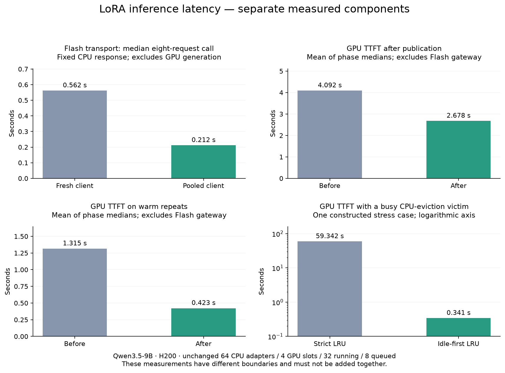

# LoRA inference admission and cache behavior

The Codeforces deployment being investigated uses one H200 per replica, four
GPU LoRA slots, 64 CPU-resident adapters, 32 running requests, and eight queued
requests. Its Modal target concurrency is 16; this is an autoscaling target,
not the number of adapters or the engine's running-request limit. Other
definitions differ: the main 16k Base definition reserves eight GPU LoRA slots.

`ROLLOUT_MAX_LOADED_LORAS` controls the CPU adapter cache.
`ROLLOUT_MAX_LORAS_PER_BATCH` controls the GPU adapter pool and the maximum
distinct adapter identities in a scheduled batch (base-model work can also
occupy an identity). Many requests can share an adapter. Reducing the CPU limit
does not shrink the GPU adapter buffers; it increases CPU eviction/reload churn.

SGLang already performs CPU LRU eviction and GPU slot replacement. An adapter
is not explicitly loaded/unloaded by Lilo for every request. Lilo remembers
immutable publications; SGLang can implicitly reload an evicted CPU adapter.
Re-registration receives a new internal adapter identity, so old prefix-cache
entries cannot automatically be reused. Aggressive TTL eviction would trade
memory retention for additional reloads and cache misses.

These distinctions come from the pinned SGLang
[LoRA manager](https://github.com/modal-projects/sglang/blob/d050d06437d96196fc68d5b4e5c246408790d537/python/sglang/srt/lora/lora_manager.py)
and [CPU registration/eviction path](https://github.com/modal-projects/sglang/blob/d050d06437d96196fc68d5b4e5c246408790d537/python/sglang/srt/managers/tokenizer_control_mixin.py).

## Changes

1. **Concurrent snapshot preparation.** Independent adapters validate in
   parallel. Mount refreshes remain exclusive with validation and SGLang file
   reads, including implicit reloads after CPU eviction. Those misses call back
   to a loopback-only sidecar endpoint that guards the read until SGLang
   acknowledges loading. Resident hits do not make this callback. Concurrent
   requests across models share an in-flight
   refresh. Registration is coalesced by immutable version even when callers
   use different exact/minimum constraints. Snapshot checksums remain verified.
2. **Warm minimum-version fast path.** A replica with a registered version at
   least as new as the requested minimum serves it immediately. A higher minimum
   forces foreground discovery; the replica never returns a version below the
   request's watermark. Active minimum-version sessions discover and prepare
   newer publications in the background (one-second poll interval, coalesced
   across models). Idle replicas do not keep reloading. This deliberately changes
   minimum-version discovery from synchronous-on-every-request to asynchronous
   when the minimum is already satisfied. An unconstrained latest request still
   refreshes synchronously. Polling and loading time can delay discovery beyond
   one second; use a newer minimum or an exact version when requiring a specific
   new publication.

   This follows the existing sampling-client contract in
   [full-fine-tunes.md](full-fine-tunes.md): latest clients guarantee a version
   at least as new as their creation watermark, and may later use newer versions.
3. **Idle CPU victims first.** When the CPU adapter cache is full, prefer the
   oldest idle, unpinned adapter. Previously, a busy LRU victim could hold the
   adapter-update lock until its long decode completed while idle victims were
   available. The newly registered adapter is excluded from victim selection.
   If all eligible old adapters are busy, preserve SGLang's safe wait for
   outstanding references; never forcibly unload an in-use adapter.
4. **Reuse sample-worker HTTP connections.** Keep a client per worker event
   loop, with request-specific authentication and routing headers. The shared
   transport has no fixed connection cap that would introduce another queue;
   it retains at most 256 idle connections for 60 seconds. Embedded callers
   can explicitly close it with `close_sampling_client()`.
5. **Handle transient admission bursts locally.** Up to two immediate local
   retries for SGLang's specific zero-token queue-full rejection, with fresh
   request IDs. Sustained overload still returns to the existing gateway
   rerouting/backoff policy. Other failures, partial output, and native multi-sequence
   batches are never replayed. `lilo_admission_retries` is retained in backend
   timing metadata and exported as `lilo.inference.admission_retries` in OTLP.

These changes preserve engine request limits, GPU slot counts, routing keys,
external retry policy, model weights, and generation parameters. They do not implement
a fleet-wide resident-adapter router. Such a router must account for queue
load as well as residency: directing every request for a popular adapter to
one replica can increase TTFT despite avoiding loads. Existing
`cache_affinity_key` gives soft trajectory affinity; it is not a residency map.

## Measurement

The scripts in this change separate three boundaries:

- `scripts/benchmark_lora_admission.py`: real H200 generation, replica-side
  request entry → SGLang submission → first nonempty SSE token → completion.
  Frozen main sidecar versus the changed sidecar, in A/B/B/A order, on the same
  engine. Twelve synthetic publishers advance through eight versions each,
  using real immutable rank-32 adapter weights read from the snapshot volume.
  Local manifests/pointers simulate publication; no trainer pointers are
  changed. Each phase crosses the 64-adapter CPU limit, repeats warm requests,
  then revisits evicted old versions. Requests use 1,024 input tokens, exactly
  64 generated tokens, `ignore_eos=True`, and unchanged concurrency of 16.
- `scripts/validate_lora_idle_eviction.py`: real H200 generation with 64 CPU
  adapters and a live 8,192-token decode made least-recently-used. Compare
  strict LRU versus idle-first eviction on the same GPU, then measure admission
  through the first actual token for the new publication. The long request is
  aborted after the measurement; this is not a throughput comparison.
- `scripts/benchmark_sampling_connections.py`: real Flash gateway, fixed CPU
  response, eight sequences per logical sample call. Isolates connection reuse
  from model execution, using A/B/B/A order after warmup. It is not GPU TTFT.

Both sides of each comparison use the same instrumentation. GPU first-token
times come from SGLang SSE events, not buffered response duration divided by
token count. Replica measurements exclude the Flash gateway; gateway results
exclude GPU generation. They must not be added into a claimed end-to-end
training speedup. Storage reads can warm across phases, so both orders and
phase-specific distributions are retained.

Both sidecar benchmark arms use the idle-first and guarded-reload SGLang
patches. The frozen baseline gets a benchmark-only reload callback using its
original global lock, so its old-version revisits are safe with the common
engine. The separate eviction experiment isolates the victim-selection change.

Removing the sidecar's serial waits lets requests reach SGLang in larger
bursts. Engine-side queue/prefill time can therefore increase while total TTFT
falls. Local queue-full retries are included in TTFT from the original request
start and reported separately; successful token counts must match before
comparing latency. The plotting script refuses incomplete comparisons.

### Publication and warm-request results

All **3,088 / 3,088** requests completed with exactly 64 output tokens: each
phase contains 384 first-use requests, 384 warm repeats, and four evicted-version
revisits. The comparison is against the existing **LoRA sidecar**, not FFT.

| Phase (execution order) | First-use TTFT p50 / p95 | Warm pre-submission p50 | Warm TTFT p50 / p95 | Phase wall time | Local retries |
| --- | ---: | ---: | ---: | ---: | ---: |
| Before A | 4.276 / 6.606 s | 1,112 ms | 1.331 / 1.922 s | 229.37 s | 0 |
| After A | 2.666 / 3.830 s | 7.6 ms | 0.429 / 0.628 s | 111.95 s | 184 |
| After B | 2.690 / 3.792 s | 7.8 ms | 0.417 / 0.604 s | 109.87 s | 198 |
| Before B | 3.908 / 6.424 s | 1,120 ms | 1.300 / 2.037 s | 223.65 s | 0 |

Pre-submission measures replica entry to the first SGLang `/generate` send.
TTFT measures replica entry to the first actual generated token, including
any local admission retries. Using the mean of the two phase medians, first-use
TTFT decreased by 35% and warm TTFT by 68%. These are controlled inference
results; they do not establish trainer TPS, FFT performance, or training-step
speedup.

Refresh calls fell from 192 to 40 per phase. First-use validation/loading still
costs time: median pre-submission latency was 3.67–4.10 s before and 2.01–2.03 s
after. Evicted-version revisits were approximately unchanged: median TTFT
0.85–0.88 s before and 0.86–0.90 s after, with only four revisits per phase.

Warm-repeat token cache hit fractions were 0% in both baseline phases and
8.1% / 9.5% in the optimized phases. First-use cache hits were 0% throughout.
The changed arrival timing affects prefix reuse as well as engine queuing;
this is not an isolated kernel or prefix-cache optimization.

The plot uses means of phase medians where indicated; the full per-phase
distributions, counts, retries, and cache measurements are in
[measurements.json](assets/lora-inference/measurements.json).
The complete request records are also saved in the `kailash-dev` Modal volume
`lilo-inference-latency-results` at `1789705240615923772/benchmark.json`.

### Busy CPU-eviction result

One constructed stress case per policy, on the same H200 with unchanged limits:

| Policy | New-adapter load | Admission → first token | Old decode finished first? |
| --- | ---: | ---: | --- |
| Strict LRU | 59.255 s | 59.342 s | Yes |
| Idle-first LRU | 0.253 s | 0.341 s | No |

Both retained 64 CPU adapters. This demonstrates head-of-line blocking under
an active LRU victim; it is not an estimate of average production latency.
The 35 SGLang lifetime/eviction/reload regression tests passed in the rollout image.

### Flash gateway connection result

Each measured phase contains 40 logical calls / 320 physical requests. There
were no additional retry attempts in these measured phases.

| Phase | Median logical call | p95 logical call | New TCP connections |
| --- | ---: | ---: | ---: |
| Fresh client A | 562 ms | 626 ms | 320 |
| Pooled client A | 211 ms | 227 ms | 0 |
| Pooled client B | 212 ms | 244 ms | 0 |
| Fresh client B | 562 ms | 608 ms | 320 |

The approximate 350 ms reduction is measured transport overhead through the
gateway with a fixed response, not a claim about trainer throughput or full
training step time.

## KV cache visibility

SGLang generation metadata contains `cached_tokens` and `prompt_tokens`; Lilo's
sampling telemetry retains these fields in each attempt's `backend_timing`.
Compute **sum(cached_tokens) / sum(prompt_tokens)** over successful physical
requests. Do not average request percentages or count eight repeated prompts
as one prompt. Break down by replica, immutable adapter version, and cold/warm
traffic before interpreting a fleet average.

GPU adapter residency, CPU adapter residency, and KV-prefix reuse are different
things. KV entries cannot be shared across different adapter weights. Qwen3.5
also needs compatible recurrent-state checkpoints for prefix reuse; a high
adapter hit rate alone does not guarantee a high token cache hit rate.

An isolated prefix probe used identical prompts three times, 16 generated
tokens per request, and a cache flush between lengths. Base-model and LoRA
requests produced the **same** cached-token counts:

| Input tokens | Cold request | First repeat | Second repeat |
| ---: | ---: | ---: | ---: |
| 1,024 | 0 | 0 | 960 |
| 1,025 | 0 | 1,024 | 1,024 |
| 2,048 | 0 | 0 | 1,984 |
| 2,049 | 0 | 2,048 | 2,048 |
| 4,096 | 0 | 0 | 4,032 |
| 4,097 | 0 | 4,096 | 4,096 |

This demonstrates a prompt-alignment effect shared with base-model inference,
not a LoRA-only cache failure. The pinned engine limits a fresh prefill's
reusable prefix to `input_length - 1`; compatibility with hybrid-model state
checkpoints also matters. The upstream
[hybrid prefix-cache issue](https://github.com/sgl-project/sglang/issues/22935)
describes this mechanism. Run the probe with
`scripts/validate_lora_idle_eviction.py --prefix-only`.

The pinned engine's `/v1/models` lists registered CPU adapters, not GPU slots.
Its `/v1/loads` supports LoRA/queue/memory load snapshots. Prometheus metrics
require SGLang's `--enable-metrics`; an absent metric is not a zero value.

## Validation and deployment

The production pool is unchanged. The benchmark apps are isolated and stop
after completing their measurements. Provider revision hashing includes the
new snapshot-access implementation, so a subsequent deployment obtains a new
pool revision. SGLang patches are checked with `git apply --check` against the
pinned revision before building the rollout image.

The full CPU suite passed with 465 tests and three skips. The SGLang-specific
suite, which requires the rollout image, separately passed all 35 tests.
Source and wheel builds also passed. Regression coverage includes cancellation,
cross-model preparation, minimum-version watermarks, background advancement,
refresh/read exclusion, implicit reloads, reference lifetime, and admission retries.

A subsequent four-client DAPO training diagnostic exposed another non-streaming
queue-rejection envelope: the pinned SGLang HTTP exception handler emits
`ErrorResponse` (`object`, `message`, `type`, `code`), rather than FastAPI's
`detail`. The local retry predicate now recognizes both forms. The sidecar suite
passes 34 tests, including the observed envelope, bounded retries, and rejection
of partial-output and batch-level replay. The DAPO diagnostic ran before this
follow-up fix; its retry counts do not measure the fix's performance. The paired
TTFT measurements above use streaming and remain measurements of their recorded
benchmark revision.

Run the benchmarks from the repository root with `PYTHONPATH=src modal run
--env <environment> <script>`. GPU benchmarks need a pre-existing Qwen3.5-9B
asset volume and immutable compatible adapters. Their results are written to
`scripts/results/lora-admission/`.
