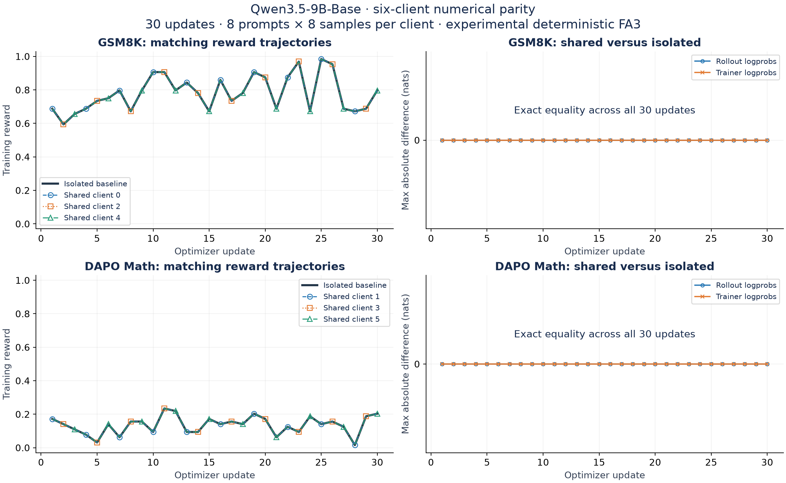
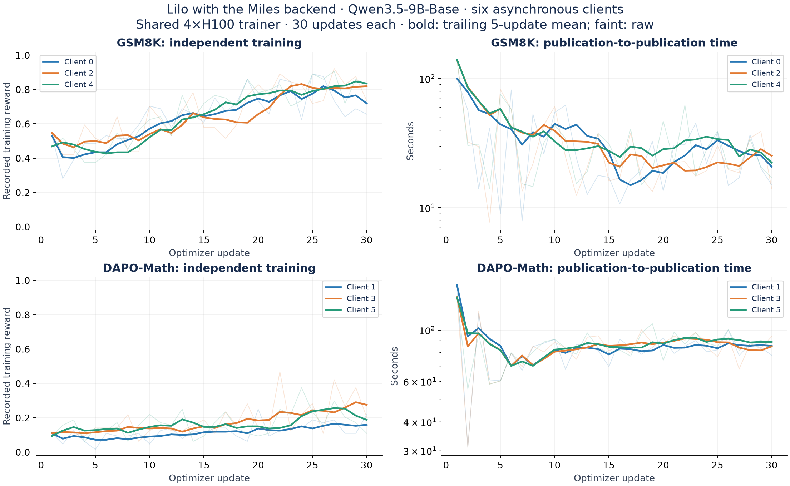
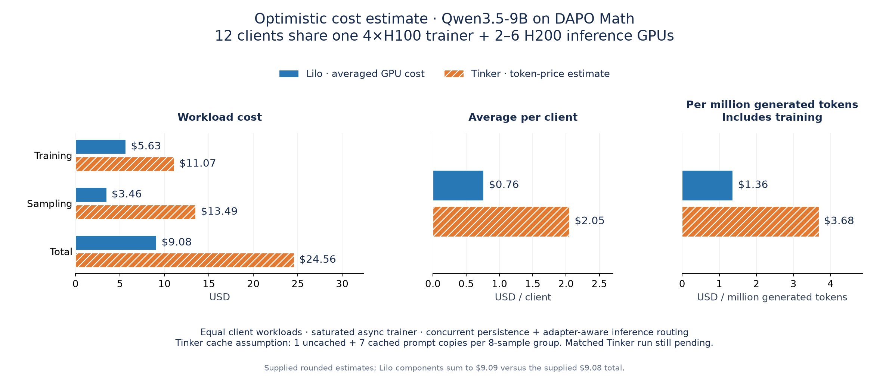
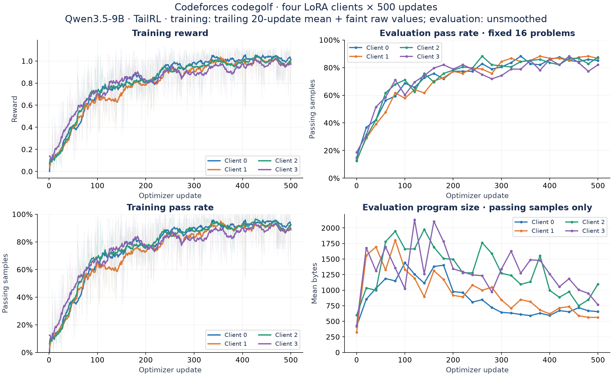
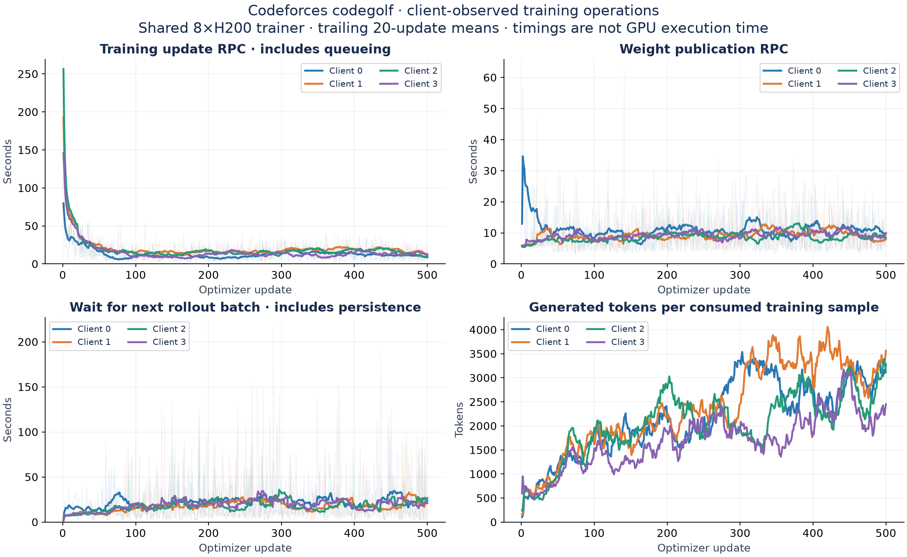

# LoRA validation

These runs exercise independent LoRA clients sharing Lilo's Miles backend and rollout
pool. They cover numerical parity on GSM8K and DAPO Math, asynchronous training
with six clients, and four complete 500-update Codeforces codegolf runs.

The figures show all clients and the full recorded update ranges. Initial updates
include compilation and cold-start costs. Configurations and metric snapshots are
linked below; the experiments use different settings and are not a controlled
throughput comparison with [FFT validation](validation.md).

## GSM8K and DAPO Math: Qwen3.5-9B-Base

### Six-client numerical parity

Six clients share a 4×H100 TP4 trainer: three rank-16 GSM8K adapters and three
rank-32 DAPO adapters. Two isolated single-client trainers provide the matching
baselines. Each client runs 30 updates with 8 prompts × 8 samples, learning rate
1e-5, and generation caps of 4,096 tokens for GSM8K and 8,192 for DAPO. Each trainer
pool has one H200 inference worker.

Prompts, sampling seeds, initial weights, optimizer state, and policy versions are
matched. This synchronous test uses the experimental deterministic FA3 path,
with no rollout policy lag. All six clients match their isolated baseline's
generated tokens, rewards, rollout logprobs, trainer logprobs, and adapter export
hashes over all 30 updates. The verification compares 17,577,507 rollout token
logprobs and 18,509,859 trainer token logprobs, with maximum absolute difference 0.



This validates isolation under the tested deterministic settings. It does not
establish bitwise parity for ordinary asynchronous training. The recorded run is
from the earlier experiment revision `1a4148f`; the subsequent upstream rebase of
[the deterministic implementation](https://github.com/modal-projects/lilo/pull/28)
has not been revalidated by this GPU run. Rewards use `numeric-final-answer-v2`
and are measured on training batches, not a held-out benchmark.

[Configuration, curves, and verification summary](assets/lora-validation/deterministic-parity.json).

### Six asynchronous clients on Lilo with the Miles backend

A separate Lilo run uses the ordinary, nondeterministic Miles backend with the same
three GSM8K rank-16 and three DAPO rank-32 clients. All six complete 30 updates on
one 4×H100 TP4 trainer and eight one-H200 inference workers. Each update uses
8 prompts × 8 samples and learning rate 1e-5; context is 16,384 tokens, generation
caps are 4,096 / 8,192, prefetch is one batch per client, and maximum policy lag is
two updates. There are no shared step barriers.



Across the three clients per dataset, mean recorded training reward increases
from 0.457 to 0.791 on GSM8K and from 0.105 to 0.207 on DAPO when comparing the first
and last five updates. These are the rewards recorded by that run's grader;
they have not been rescored and should not be compared numerically with the
deterministic run's grader. Bold curves show trailing five-update means; faint
curves retain every raw observation. Timing is the interval between completed
client publications, including waiting, rather than GPU execution time.

All six final checkpoint round trips reproduce trainer and inference logprobs
with zero difference and byte-identical adapter exports. This checks checkpoint
restore, not exact equivalence of future nondeterministic training updates.
The run uses Miles `f6d0257d83b7c14f4ce43ecfcd71d955112f6e0e` and the integration
validated in [PR #15](https://github.com/modal-projects/lilo/pull/15).

[Configuration, all per-client points, and checkpoint checks](assets/lora-validation/async-math.json).

## Optimistic cost estimate: 12-client DAPO Math on Qwen3.5-9B

This separate configuration has **12 training clients sharing one 4×H100 trainer
and 2–6 H200 inference GPUs**. The reported setup includes concurrent persistence
and inference routing that takes resident LoRA adapters into account. The estimate
assumes equal training workloads across clients and fully asynchronous execution
optimized for throughput, keeping the trainer saturated.

The Lilo figures below are the experiment author's averaged GPU-cost accounting.
The Tinker figures are a projection from published token pricing applied to Lilo's
token counts. **The same DAPO workload has not yet been run on Tinker to validate
the projected bill.** This 12-client cost case is separate from the six-client
math runs above and the four-client Codeforces run below.



| Cost | Lilo: averaged GPU cost | Tinker: token-price estimate |
| --- | ---: | ---: |
| Training | $5.63 | $11.07 |
| Sampling | $3.46 | $13.49 |
| Total | $9.08 | $24.56 |
| Average per client | $0.76 | $2.05 |
| Per million generated tokens, including training | $1.36 | $3.68 |

Figures retain the supplied rounded amounts; the displayed Lilo components sum
to $9.09 while the supplied total is $9.08.

### Token-price calculation and assumptions

The projection splits tokens into uncached prefill, cached prefill, generated
output (decode), and training, using the corresponding rates for the same model
from [Tinker's published pricing](https://tinker-docs.thinkingmachines.ai/tinker/models/).
For each group of eight samples sharing a prompt, it assumes one prompt copy is
charged as uncached prefill and seven as cached prefill. That cache split is an
assumption, not measured Tinker cache behavior.

With rates expressed in dollars per million tokens:

```text
sampling = (uncached_prefill_tokens × uncached_prefill_rate
          + cached_prefill_tokens × cached_prefill_rate
          + generated_tokens × decode_rate) / 1,000,000
training = training_tokens × training_rate / 1,000,000
total = sampling + training
average_per_client = total / 12
cost_per_million_generated_tokens = total / (generated_tokens / 1,000,000)
```

This is an optimistic estimate for this specific utilization and workload mix.
Equal workloads make the per-client average straightforward. If clients consume
very different token counts or GPU time, equal cost allocation will not reflect
their individual use. If asynchronous work does not keep the trainer saturated,
idle GPU time raises the effective cost per token. The figures also do not isolate
the individual cost impact of concurrent persistence or adapter-aware routing.

For a hosted multi-tenant service, allocation of shared capacity and idle time,
operating overhead, and service margin remain pricing decisions. For self-serve
use, one user can instead pay for a shared node across multiple experiments and
benefit directly from its utilization. A matched DAPO run on Tinker is still
needed to validate the actual bill and cache assumptions.

[Supplied cost figures and scenario assumptions](assets/lora-validation/dapo-cost-estimate.json).

## Codeforces codegolf: Qwen3.5-9B

### Four clients, 500 updates each

Run `tailrl-hero-v3-lr1e5` completed all 2,000 client updates on September 18, 2026.
Four independent rank-32 adapters share one 8×H200 trainer (TP8, CP1, DP1) and a
pool configured for 4–8 one-H200 inference replicas. The model is Qwen3.5-9B,
with 65,536-token context and a 16,384-token generation cap.

Each client uses TailRL at learning rate 1e-5, 4 prompts × 8 samples per update,
and asynchronous rollouts with maximum policy lag four. The workload follows
the [Codeforces codegolf example](../examples/codeforces-codegolf/README.md):
programs are executed against tests, with reward for correctness and short
solutions. Training uses 123 problems; evaluation uses the same separate
16 problems every 20 updates, with eight samples per problem.



| Client | Updates | Initial evaluation pass rate | Final evaluation pass rate |
| --- | ---: | ---: | ---: |
| 0 | 500 | 14.84% | 85.16% |
| 1 | 500 | 13.28% | 86.72% |
| 2 | 500 | 12.50% | 87.50% |
| 3 | 500 | 18.75% | 82.03% |

Evaluation pass rate is the fraction of 128 generated samples that pass all
tests, not pass@8. All four histories contain one model ID each; no restarted
trajectories are joined together. Training curves show trailing 20-update means
with faint raw values; evaluation points are unsmoothed. Program-size averages
include passing samples only, whose composition changes as correctness improves.
The evaluation set is small and fixed, so these results establish learning on
this workload rather than broad Codeforces generalization.

### Client-observed operation timings



The update RPC includes shared-trainer queueing and forward/backward plus the
optimizer. Publication is measured separately. Rollout wait includes time to
obtain and persist the next batch while background generation overlaps other
work. These panels exclude evaluation and checkpoint pauses and are not full
wall-clock step time, GPU utilization, or trainer TPS. Initial updates are shown
and include compilation; generated lengths also change substantially during
training.

This completed run is distinct from the later `tailrl-otlp-v1` observability run.
It uses Miles `ef3807c0ef659d7c6d8494c4933bd7ee0332700f`. The 64K experiment
definition is recorded in the snapshot; it is not the bundled 16K Base-model
definition. No FFT speedup or reward-parity claim follows from these plots:
the historical FFT codegolf run used different optimization and evaluation
settings.

[Configuration, complete training metrics, and every evaluation](assets/lora-validation/codegolf.json).

## Reproduce the figures

The [figure directory](assets/lora-validation/README.md) contains compact metric
snapshots, source run identifiers, source-file SHA-256 hashes, and an offline
renderer. From the repository root:

```bash
uv run docs/assets/lora-validation/render.py
```

This regenerates all five PNGs without Modal or W&B access. It reproduces the
figures, not the GPU experiments. See [Working with Multi-LoRA](multi-lora.md)
for deployment, batching, and sampling configuration.
