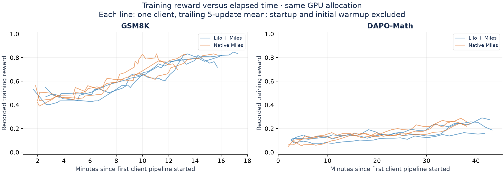
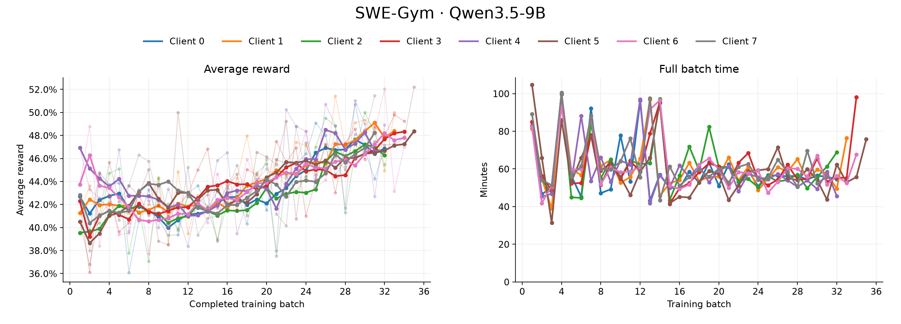
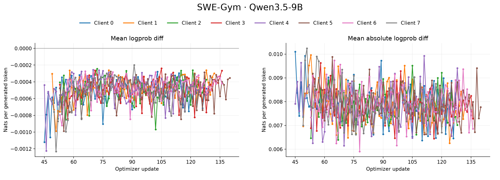
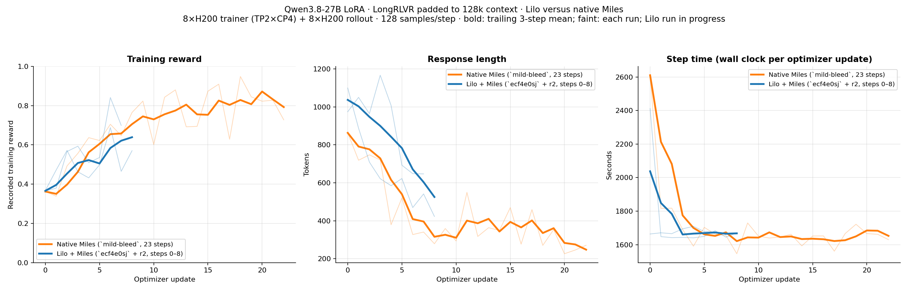

# LoRA validation

Our primary validation so far has been multi-lora async RL with Lilo's Miles backend on gsm8k, dapo math, as well as a longer codeforces codegolf run. 

(Note in all the plots step 0 typically incurs cold-start/compilation times). 

## GSM8K and DAPO Math: Qwen3.5-9B-Base

### Async RL: Lilo versus Miles

Both runs complete 30 updates for each of six clients on one 4×H100 TP4 trainer
and eight H200 inference workers. GSm8k clients use rank 16 + 4k generation cap, dapo uses rank 32 + 8k. Batch size is 8 groups x 8 samples per group. For the native Miles case, we use their Tinker gateway and a fixed rollout pool on Modal. 

| Metric | Lilo | Native Miles |
| --- | ---: | ---: |
| GSM8K median step | 21.95 s | 17.65 s |
| DAPO median step | 84.28 s | 74.81 s |
| GSM8K mean training reward | 0.659 | 0.642 |
| DAPO mean training reward | 0.156 | 0.169 |
| Training interval | 43.27 min | 38.98 min |

The "step time" here for async RL is the time from one weight publication to the next (which incorporates rollout buffer fill, forward_backward, and optim-step time in between). 

same plots vs wall clock time: 

## DAPO Math: Qwen3.5-9B cost estimate

As part of our initial cost validation vs Tinker, we were interested in seeing what the price differential could be 

12 clients sharing one 4×H100 trainer and 2–6 H200 inference GPUs. Optimistic
Lilo GPU-cost accounting versus projected Tinker token charges; the Tinker bill
has not been measured on this workload.

We have a more comprehensive discussion of pricing differences (as well as more analysis into how this difference scales with multi-tenancy) in [workload tuning and memory budgeting](multi-lora.md#how-to-optimize-lilo-workloads-for-token-pricing).

## Codeforces codegolf: Qwen3.5-9B

Four rank-32 clients, 500 updates each, sharing an 8×H200 TP8 trainer and 4–8 H200
inference workers. We used async TailRL for this example, with 64k context and 16k generation cap per turn. This is analogous to a similar experiment we did on the FFT side, with the full details available in `examples/codeforces-codegolf`

Client-observed training, publication, and rollout timings:

### Deterministic Training

One experimental path we've been working on is having multi-tenant runs be fully deterministic. On the inference side, this reduces to the existing batch-invariant implementations that SGlang already has, but on the training side, this means that the forward_backward and optimizer step passes are completely batch-invariant as well such that a client's forward_backward executes with the exact same numerical results no matter how its batches are scheduled through multi-tenant heterogeneous trainer batches. We are able to show preliminary results of deterministic training runs where results are bitwise-identical with single-tenant LoRA on gsm8k + dapo-math: 

The main source of trainer non-determinism was in the fa3 backwards kernel, as well as ensuring ordered gradient accumulation with multiple clients' packed microbatches. 

## SWE-Gym: Qwen3.5-9B

Eight rank-32 LoRA clients run async multi-turn RL on 31 training tasks with
128k context, sharing one 8-GPU trainer (H200 initially, H100 after restart)
and eight H200 inference replicas. Each batch contains 32 groups × 8 trajectories,
split into four optimizer updates. These are interim results from September 25, 2026.

Training reward shows raw values and a five-batch trailing mean. Batch time is
start-to-start, including rollout collection and checkpointing; preemption downtime
is excluded.

Logprob differences compare the training and rollout policies on generated tokens.

## LongRLVR at 128k context: Qwen3.8-27B (2026-09-18)

Qwen3.8-27B LoRA r32 on LongRLVR-Data, generation cap 4k, GRPO 16 groups × 8
samples, lr 1e-4, PPO clip 0.8/1.28, no KL. Both runs use an 8×H200 trainer and
8 H200 rollout GPUs; Lilo runs the trainer as TP2×CP4 and the rollout pool as
4×TP2 SGLang workers.

- Context parallelism (CP4) is what makes the 128k prompt fit on a single
  8-GPU trainer. Miles does not support context parallelism on the Tinker /
  multi-LoRA loss path, so the sequence-sharded loss and the all-gather around
  cross entropy are implemented in Lilo's Miles backend and are being upstreamed
  (radixark/miles#3284). The native Miles run in the plot therefore trains the
  same prompts without CP.
- Step time is at parity: 1676 s median for Lilo versus 1658 s for native Miles.
- Reward tracks the same trajectory over the measured steps (mean 0.56 versus
  0.57 over steps 0–8).
- Lilo's responses stay longer than Miles' over the same window. This is
  related to a loss-weighting delta between Lilo and Miles, which we are
  actively looking into.

The Lilo curve covers the steps completed at the time of writing; the native
Miles curve is the full run.
