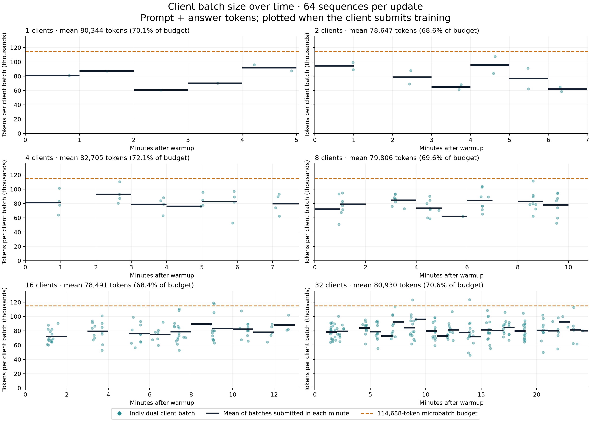
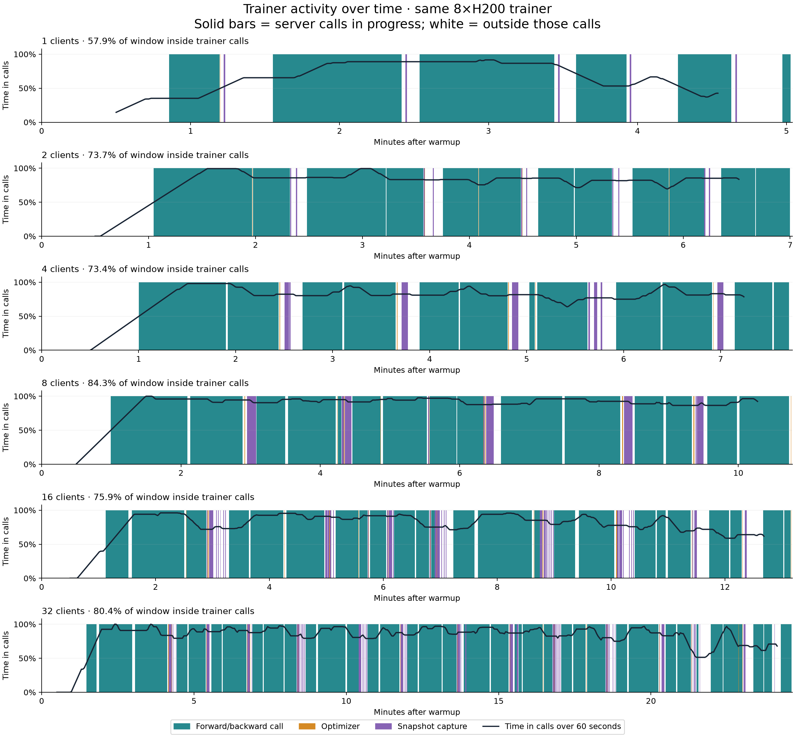

# Working with Multi-LoRA

The Miles backend runs several LoRA adapters on a shared base model. Each Tinker
training client has its own adapter, gradients, and optimizer state. Clients
share trainer GPUs and a rollout pool.

See [LoRA validation](lora_validation.md) for shared-client parity checks and
complete math and Codeforces training curves.

## Create clients

Connect to a deployment with a Miles LoRA definition enabled:

```python
import tinker

service = tinker.ServiceClient()  # TINKER_BASE_URL and TINKER_API_KEY
clients = [
    service.create_lora_training_client(
        base_model="Qwen/Qwen3.5-9B-Base", rank=16,
    )
    for _ in range(6)
]
```

The bundled `qwen3_5_9b_base_miles_lora_16k` definition provides six adapter slots
on four H100s, with tensor parallelism of 4 and a 16,384-token context. Placement
fills available trainer capacity automatically. Clients using the same
definition may share an engine; their placement depends on available slots and
deployment limits.

Clients can use different ranks, up to 32. LoRA alpha and target modules are set
by the deployment. This definition requires `train_attn`, `train_mlp`, and
`train_unembed` to be true, which are the SDK defaults. Leave the per-client
initialization `seed` unset. Reuse clients across updates to keep their adapter
and optimizer state loaded.

## Submit training work

Submit work from clients concurrently so the engine can batch their requests.
Keep one ordered submission loop per client. Each client's operations execute
in submission order, and clients can advance at different rates.

At each dispatch, the engine checks the next queued operation for every client.
A `forward_backward` request can run with other ready requests that use the same
`loss_fn` and `loss_fn_config`. This includes consecutive compatible requests
from one client. Ranks, batch sizes, and sequence lengths can differ. The engine
starts with the work already queued. Other losses, optimizer steps, forward-only
calls, and adapter captures run as separate operations on the shared GPU lane.

Miles packs the combined batch into microbatches using the deployment's token
budget: 16,384 tokens per GPU for this definition. Larger submissions span
multiple microbatches and run to completion before the next dispatch. Keep
outstanding work bounded, since large submissions and long queues delay other
clients. Scheduling order depends on the queued operations, so clients can
experience different wait times.

Submit each client's forward/backward and optimizer calls, then check both
futures:

```python
import asyncio
from tinker import types

adam = types.AdamParams(learning_rate=1e-5)

async def update(client, batch):
    forward = await client.forward_backward_async(
        batch, loss_fn="importance_sampling",
    )
    optimizer = await client.optim_step_async(adam)
    result = await forward.result_async()
    await optimizer.result_async()
    return result

# Each batch contains data for its corresponding adapter.
results = await asyncio.gather(*(
    update(client, batch)
    for client, batch in zip(clients, batches, strict=True)
))
```

For gradient accumulation, submit all of a client's `forward_backward` calls
before its `optim_step`. The example above waits for all clients to finish;
an async RL controller can publish and start the next rollout for each client
as soon as its update finishes.

### Batch requirements

- Send each adapter's data through its own training client. The engine combines
  compatible requests across clients.
- Inputs must be text tokens. `target_tokens` must match the length of
  `model_input` and be shifted by one token. Align per-token weights, advantages,
  and sampling logprobs with those targets. Mask prompt positions when training
  on completions.
- Supported losses are `cross_entropy`, `importance_sampling`, `ppo`, `cispo`,
  and `dro`. For RL losses, compute advantages in your controller and supply
  the logprobs from the sampled policy.
- Each prompt plus completion must fit within the context limit.

## Publish adapters and generate rollouts

Publish after `optim_step()` and wait for publication to finish before sampling
from the updated policy.

`save_weights_and_get_sampling_client()` returns a client that serves the
published version or a newer one. To select an exact version, call
`save_weights_for_sampler(name)` and create a sampling client from the returned
path. Sampler publications use PEFT format. Both sampling methods use the
deployment's shared multi-LoRA rollout pool.

A replica loads adapter versions as needed. The bundled 16K definition caches
up to 64 versions per replica across all clients, evicting older versions and
reloading them when requested. The pool keeps eight one-H200 replicas warm and
allows up to eight LoRAs in an inference batch. All clients share this capacity;
model cold starts and adapter loading contribute to sampling latency.

When prefetching rollouts, set a maximum policy lag in your controller and retain
the returned sampling logprobs. The backend accepts batches generated by older
policies. Results can vary with batch packing, request scheduling, and the
policy version served, even when sampling seeds match.

### Publication and persistence scheduling

Adapter capture uses the shared GPU lane. Persistence then runs in the
background, allowing training and other adapters' publications to proceed.
Each adapter can have one publication in flight. A second publication waits
for the first to persist and holds up later operations from that client.

Checkpoints share one persistence worker. While it is busy, new checkpoints
stay queued and other clients' ready training can proceed. A queued checkpoint
holds up later operations from its own client. Model creation, loading, and
unloading wait for outstanding persistence.

## How to optimize Lilo workloads for token pricing

With a fixed GPU allocation, higher useful tokens per second lowers GPU cost per
token. Measure the whole RL loop: generation, training, optimizer updates, and
weight publication. Count the tokens from completed updates over the same wall
interval for every client.

```text
output TPS = total generated tokens used by completed updates / elapsed seconds
GPU $ per million output tokens = 1,000,000 × GPU dollars per second / output TPS
```

Include both trainer and inference GPUs in the spending rate, including their
idle time. For autoscaled pools, use the actual GPU-seconds over the interval.
For a full bill, also include startup, retries, CPU, RAM, storage and shutdown.
Keep the model, training recipe and output-length limits fixed when comparing
configurations so that extra tokens still represent useful training work.

### Choose a batch size and a starting client count

A client batch is one client's submission. A microbatch is the portion of the
combined submissions that the trainer processes in one forward/backward pass.
The engine can combine compatible client submissions and Miles can split that
work into several microbatches.

Let `B` be the average prompt-plus-answer tokens in a client batch, and `C` the
configured microbatch token budget for a tensor-parallel group. For the sweep
below, all eight GPUs form one such group: `C = 114,688`. Tensor parallelism
splits the model across those GPUs; the budget remains 114,688. Data or context
parallelism changes the calculation, so check the deployment's topology before
using a per-GPU setting as a node-wide capacity.

For a group with enough compatible work ready, a rough packing estimate is:

```text
ready client batches to supply one microbatch ≈ ceil(C / B)
microbatches needed for k ready batches       ≈ ceil(k × B / C)
```

These estimates assume even packing. Individual sequence lengths and padding
affect the actual split. With `B ≈ 80,000` and `C = 114,688`, two ready client
batches supply about 160,000 tokens, spread over roughly two microbatches.
The average fill would be about 70%. Four such batches could fill roughly three
microbatches to 93%. These are examples of packing arithmetic; the sweep did
not record actual per-microbatch fill.

The number of ready batches varies while clients sample, train and publish.
Use a second estimate to choose how many independent clients to try:

```text
Q = sustainable trainer tokens/second with a continuously supplied queue,
    including the required optimizer and publication work
T = one client's update interval with rollout prefetch and little shared queuing
starting client count to supply the trainer ≈ ceil(Q × T / B)
```

This compares the trainer's consumption rate with each client's supply rate
`B / T`. For example, a hypothetical trainer sustaining 10,000 tokens/s and
clients supplying 80,000 tokens every 60 seconds suggests starting near eight
clients. Measure `Q` and `T` with the same token-count convention and workload.
Shared inference capacity and contention change them as concurrency grows;
use the estimate to choose a sweep range. Batch size alone cannot determine
the best client count.

### Keep clients asynchronous and measure the tradeoff

Run each client's ordered update loop independently. Submit forward/backward
and optimizer work before waiting on their results. Publish after that client's
optimizer finishes. Prefetch its next rollout while the current batch trains,
with a bounded policy lag and the sampled policy's logprobs. One prefetched
batch per client is a useful starting point. Let each client advance as soon as
its dependencies finish; a barrier after every update leaves faster clients
waiting for slower ones.

Sweep client counts on fixed hardware, keeping client batch size fixed. Exclude
warmup consistently and fully drain each experiment before the next. Record
total TPS, per-client TPS, update latency, publication wait, and trainer activity.
Stop increasing concurrency when the extra TPS is small compared with the added
client latency or memory use. If trainer gaps coincide with unfinished rollouts,
inspect inference throughput and request waits. If many batches are queued,
inspect trainer scheduling and publication delays before adding more clients.

For a token-priced service, calculate a comparison using each category separately:

```text
estimated token charge = (training tokens × training rate
                       + uncached prompt tokens × uncached prompt rate
                       + cached prompt tokens × cached prompt rate
                       + generated tokens × generation rate) / 1,000,000
```

Rates here are dollars per million tokens. Use the service's counting rules and
state the prompt-cache assumption. Compare this charge with the GPU cost for
the same completed work. The per-client average `total GPU cost / clients` is
useful when clients do similar work; clients with different token volumes and
sequence lengths need separate usage accounting.

### What the DAPO sweep showed

We ran 1, 2, 4, 8, 16 and 32 clients on one 8×H200 trainer and eight single-H200
inference replicas, using Qwen3.5-9B-Base and rank-32 adapters. Each client ran
eight async updates of 8 prompts × 8 answers, with a 4,096-token answer limit,
one prefetched batch, and maximum policy lag two. Checkpoint saving and
evaluations were disabled. The first two updates per client were excluded.
Every point used fresh apps and drained before the next point started.

**The total sweep took 4 h 43 min 19 s**, from September 18, 2026 at 07:48:33 UTC
through 12:31:52 UTC. This spans the first attempted launch through final
cleanup, including startup, warmup, a monitoring fix, two discarded 16-client
attempts, and recovery time. The six successful measurement windows sum to
**1 h 8 min 24 s**. Preparing the benchmark and generating the report are outside
that elapsed-time figure. [Timing records](assets/lora-validation/dapo-client-scaling/elapsed-time.json).


Average client batches contained 78,000–83,000 tokens, or 68–72% of the configured
microbatch budget. The 114,688-token setting was held fixed; the largest batch
that fits in GPU memory was not measured.



Each dot is a client's submitted batch. Black segments are the mean of batches
submitted in each minute. The dashed line is the microbatch budget. A submission
above the line can be split. Counts include prompt and answer tokens before
padding; Miles restores the final target token, so this count exceeds the
returned loss-token metric by one token per sequence.



Teal bars mark forward/backward calls, orange marks optimizer updates, and purple
marks snapshot capture. White gaps are time outside those calls. The black line
is the fraction of each centered 60-second window spent inside them. Each row
has its own elapsed-time scale. Short optimizer calls are easier to see in the
[PDF](assets/lora-validation/dapo-client-scaling/trainer-activity.pdf).

| Clients | Output TPS | TPS/client | Time inside trainer calls | GPU $/million output tokens, including training |
| ---: | ---: | ---: | ---: | ---: |
| 1 | 1,411 | 1,411 | 57.9% | $14.30 |
| 2 | 1,978 | 989 | 73.7% | $10.20 |
| 4 | 3,798 | 949 | 73.4% | $5.31 |
| 8 | 5,220 | 653 | 84.3% | $3.87 |
| 16 | 8,390 | 524 | 75.9% | $2.40 |
| 32 | 9,298 | 291 | 80.4% | $2.17 |

More clients reduced the large gaps visible with one client. Time inside trainer
calls rose from 58% at one client to 84% at eight, then fell to 76% at 16 and
reached 80% at 32. The average number of client batches combined per
forward/backward call rose from 1.0 to 4.9 across the sweep. Larger combined
calls help explain how TPS can keep rising while the occupied time varies.

These bars measure server call duration. A call includes coordination and data
handling alongside GPU work; white gaps can include preparation and response
handling. The logs did not record each microbatch's token count or execution
interval. GPU compute utilization and exact token-fill percentages therefore
remain unmeasured. All 378 measured updates reconcile with the logged sequence,
optimizer and snapshot counts.

Sixteen clients delivered 90% of the output TPS at 32 clients, with mean update
time of 115 seconds versus 179 seconds. It was a useful choice when both total
throughput and individual experiment progress mattered. The existing scheduler
also delayed later-created clients' optimizer/publication work at high
concurrency. This short sweep includes that behavior and the final clients
finishing after others have stopped; longer runs and scheduler changes can
change the result.

Costs use the sweep's September 18 price snapshot and include idle time across
all 16 GPUs during the measured windows. Startup, warmup, retries, CPU/RAM and
shutdown are excluded. The Tinker comparison applies published prices to the
same token counts, assuming seven of eight prompt copies are cached. A matched
Tinker run is still needed to validate that estimate. The
[full benchmark and reproduction code](https://github.com/modal-projects/lilo/pull/42)
record configuration, isolation checks and limitations;
[copied data and figure sources](assets/lora-validation/dapo-client-scaling/README.md)
are included here.

### Budget GPU memory for adapters and activations

Plan memory on the most heavily loaded GPU. A useful accounting model is:

```text
GPU memory needed = shared base-model weights
                  + allocated adapter weights, gradients and optimizer state
                  + activations for the executing microbatch
                  + temporary compute/communication/capture buffers
                  + reserve for allocation peaks and fragmentation
```

The base model is shared. Each adapter has separate trainable weights, gradients
and Adam state. For a linear layer with input width `d_in`, output width `d_out`
and LoRA rank `r`, the adapter has `r × (d_in + d_out)` parameters. Sum over the
target layers, then account for tensor-parallel sharding or replication and
the dtypes of weights, gradients, optimizer moments and any master weights.
Weights alone understate the training memory cost.

The [Miles/Bridge adapter implementation](https://github.com/radixark/Megatron-Bridge/blob/582783a05442245647239e4c5e7d733d7f0e00ea/src/megatron/bridge/peft/multi_lora_layers.py#L202)
allocates adapter parameter arrays using the
configured slot capacity and maximum rank. Lowering an individual client's rank
or leaving slots empty can leave those arrays allocated. All six sweep points
had capacity for 32 rank-32 adapters. To recover that reserved capacity, adjust
the deployment's slot/rank limits and recreate the trainer, then measure memory
after representative optimizer steps have initialized their state.

Activations are the intermediate tensors retained for backward. They depend on
the tokens and sequence shapes being processed, model layers, rank, parallelism
and recomputation settings. Gradients for the adapters still pass through the
frozen base model. Active microbatches need those intermediate tensors even
though the base weights are frozen. A queued client batch does not need a full
set of forward activations yet; queued inputs, outputs and prefetched rollouts
still consume memory wherever the implementation holds them. Increasing client
count therefore increases adapter state and queued data, while the microbatch
budget controls how much training work executes together.

Increasing rank or slot capacity leaves less room for activations. Increasing
the microbatch budget uses more activation memory and may improve packing.
Changing sequence lengths can change memory peaks even at the same total token
count. [Activation recomputation](https://docs.pytorch.org/docs/stable/checkpoint.html)
reduces saved tensors by repeating some forward computation during backward;
measure the resulting TPS as well as the memory savings. The sweep used full
recomputation, one layer at a time. This is separate from saving checkpoints to
disk.

To set the token budget, initialize the intended adapter capacity and exercise
forward/backward, optimizer updates and snapshot capture with representative
long batches. Record peak device memory on every rank, including allocator
reserve and temporary buffers. Increase `max_tokens_per_gpu` in small steps,
keep room for the longest allowed batches, and retain the setting that improves
end-to-end TPS within those memory limits. Repeat when rank, target modules,
slot count, context length or parallelism changes.

Inference has its own memory budget: base weights, resident adapter versions,
KV cache and temporary buffers. More retained adapters leave less room for
cached sequences. Prefetch concurrency and adapter retention should keep
rollouts arriving fast enough without creating long inference queues or
repeated cache eviction. Measure that side separately from trainer memory.

## Checkpoint and recover

Use `save_state()` regularly to save each client's adapter and optimizer state.
A shared trainer failure loses unsaved state for every resident client. Wait
for a checkpoint to complete before relying on it for recovery.

Restore with `load_state_with_optimizer()` on a new matching LoRA client.
Recovery requires the same base model, LoRA configuration, Miles revision, and
trainer topology. Upgrading from the earlier checkpoint format requires a
fresh run.

At deployment, Lilo resolves `radixark/miles` `main` and builds that commit into
the image. The commit SHA is recorded in checkpoints and remains fixed for the
running deployment. Deployment requires Git/network access to resolve the
branch. To rebuild a specific version, set `LILO_MILES_COMMIT` to its full SHA
before deployment. Megatron and Megatron-Bridge use their separately configured
revisions.
