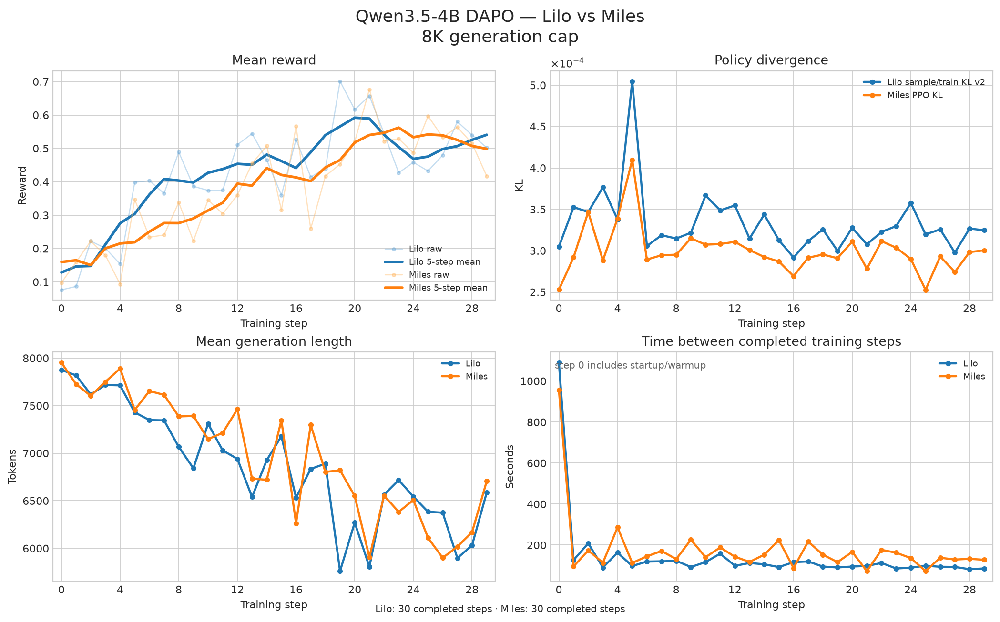
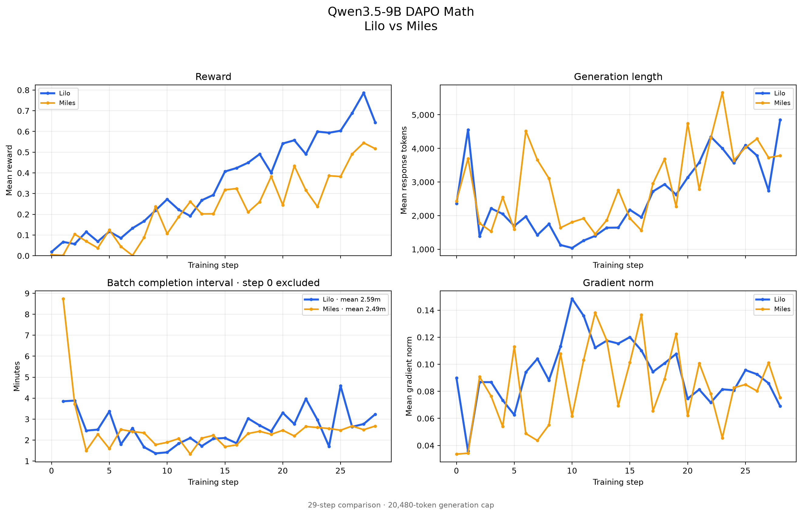
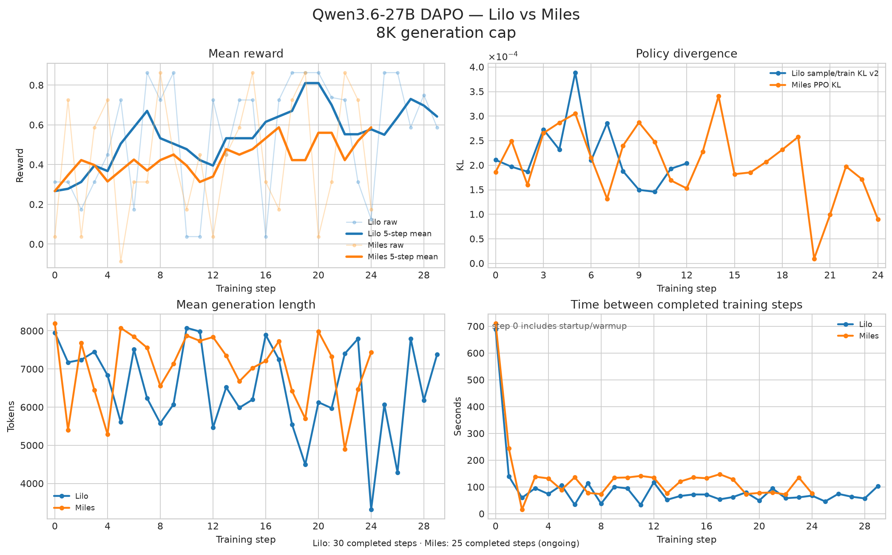
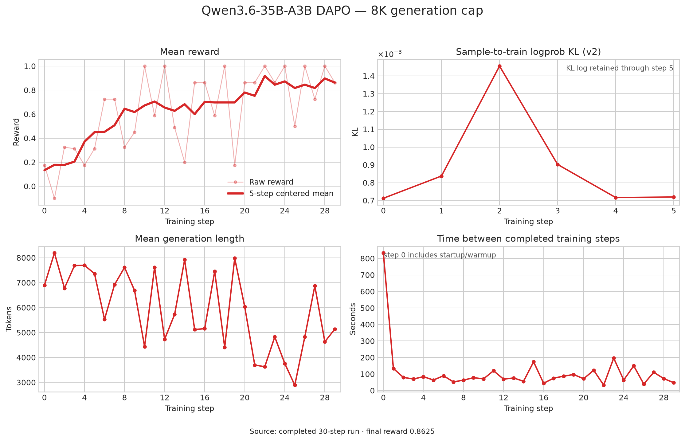
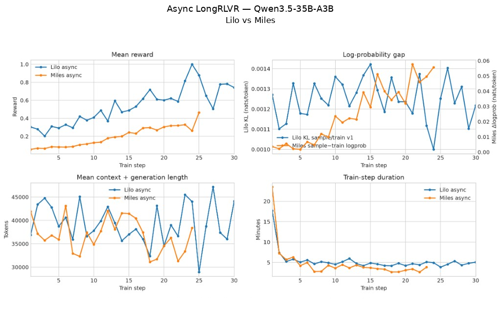
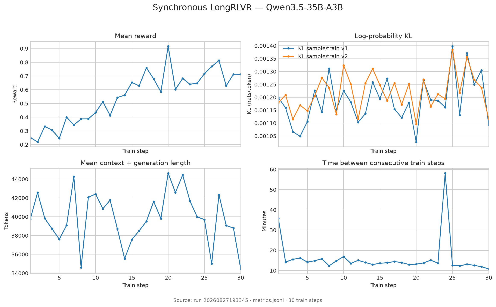
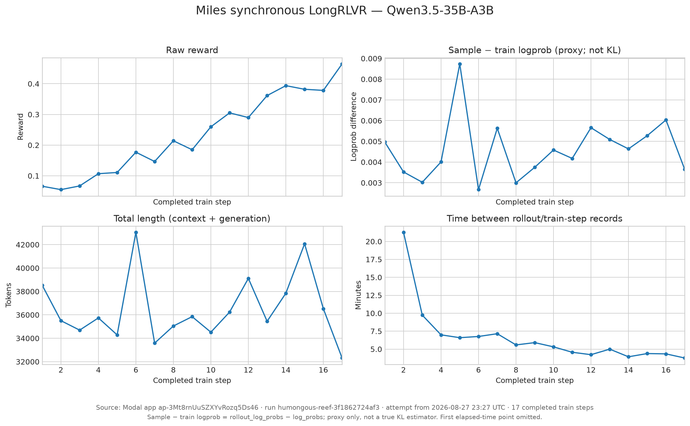
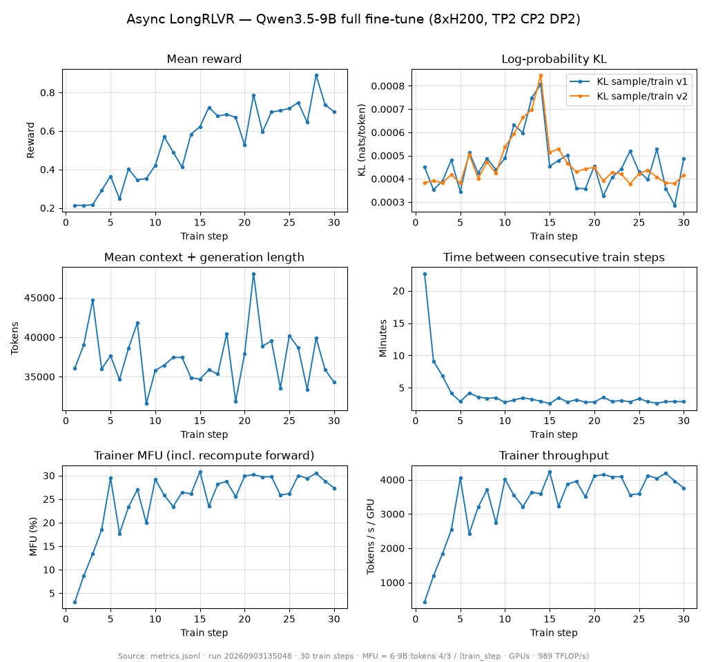

# Validation

As Tinker is fully LoRA-based, we primarily focused our validation for e2e RL full-parameter training jobs against [Miles](https://github.com/radixark/miles).We're able to show parity with the qwen3.5 and qwen3.6 series of models on standard reasoning workloads with up to 64k context length and provide the configs for each of these trainer engines with the current Lilo version.

Note that step 0 commonly includes compilation and cold-start times.

## DAPO Math

### Qwen3.5-4B

30-step Lilo and Miles FFT runs on DAPO Math with an 8k generation cap:

### Qwen3.5-9B: Lilo and Miles

This is a 29-step Qwen3.5-9B DAPO Math comparison with async RL and a 20k
generation cap.

We see comparabale reward and step time between Lilo and Miles.

### Qwen3.6-27B

Lilo and Miles FFT runs on DAPO Math with an 8k generation cap. Lilo completed
30 steps; the ongoing Miles run is shown through its latest completed step:

### Qwen3.6-35B-A3B

30-step Lilo FFT on DAPO math with 8k generation cap:

## LongRLVR: Qwen3.5-35B-A3B

To test longer context length, we utilize the [LongRLVR dataset](https://huggingface.co/datasets/Guanzheng/LongRLVR-Data). For agentic workloads, we've also done some testing with these models on TerminalBench.

### Asynchronous Lilo and Miles

Lilo vs Miles using async RL on LongRLVR with up to 64k context + generation length:

### Sync RL

Sync RL Lilo vs Miles on LongRLVR:

### Qwen3.5-9B async

30-step Lilo FFT async RL run on LongRLVR with Qwen3.5-9B (8xH200, TP2 CP2 DP2), 16 groups of 8 samples per step, 8k generation cap and up to 64k context. The bottom row adds trainer MFU (counting the activation-recompute forward, against 989 TFLOP/s dense BF16 per H200) and tokens/s/GPU; the ramp over the first five steps is `torch.compile` recompilation settling, after which the trainer holds 26–31% MFU.

### other

See [Working with Full Fine-Tunes](full-fine-tunes.md) before designing an RL
experiment with Lilo.

