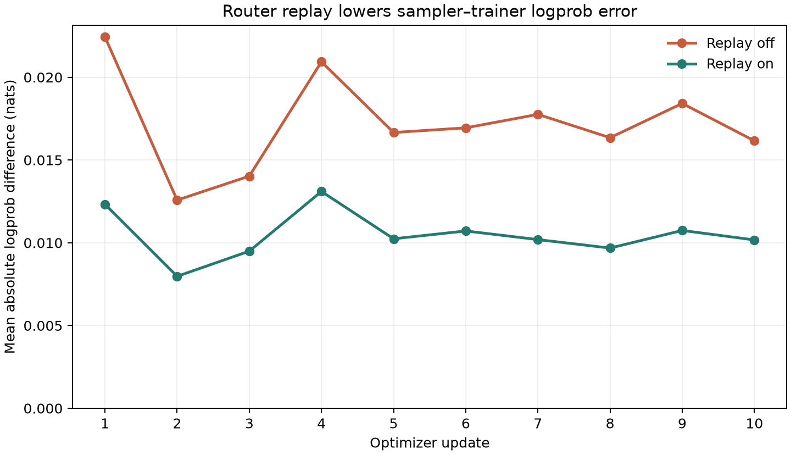
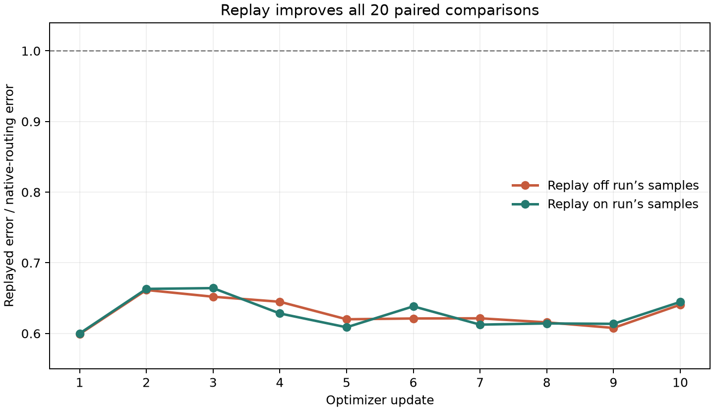
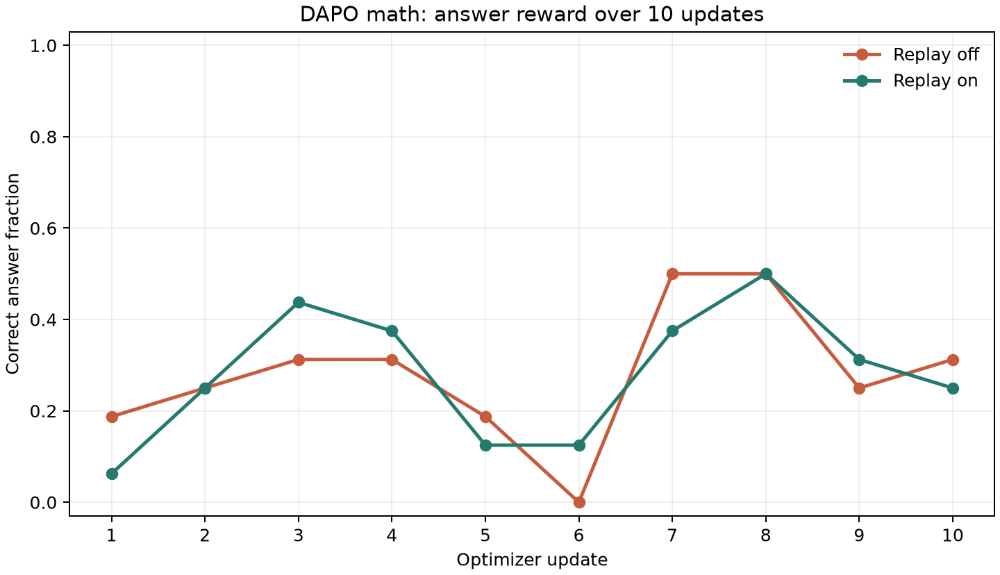

Live MoE router-replay validation for PR #62, performed on 2026-09-25.

Two matched 10-step runs used Qwen/Qwen3-30B-A3B-Instruct-2507 and DAPO math
prompts. The trainer used four H200s, TP4/EP4/CP1, attention LoRA rank 32 and
activation recomputation. The SGLang sampler used two H200s with TP2. Both runs
started from the same model and optimizer checkpoint. Each update sampled four
prompts with four completions each, capped at 4,096 generated tokens.

Replay reduced token-weighted mean absolute sampler–trainer logprob error from
0.0172560558 to 0.0104916665 nats (39.2%). All 20 same-token, same-weight paired
comparisons favored replay. All 320 rollout route hashes matched all four trainer
ranks; enabled forwards and backward recomputation consumed all 48 replay streams.

This is an attention-LoRA replay smoke test, not a full DAPO reproduction or a
convergence/throughput benchmark. Experts were frozen. Equal-reward groups yielded
zero advantages, so 6 baseline and 7 replay updates had nonzero gradients; all 10
optimizer steps in each run succeeded. Approximately 71% of completions hit the
response cap. Mean answer reward was 0.28125 in both runs. CP>1 and multi-node
training were not tested.

The numerical runs used PR revision `ebeeac6bda259f4df523e379753ddd50f68d67a0`,
Miles revision `cc76e23915b2132ecfff65b97331fd83b02637e6`, an added experiment recipe
and controller, and the runtime changes in [runtime-validation.patch](runtime-validation.patch).
That patch fixes the upstream Miles import location, adds its regression test,
and adds optional hash/queue-consumption logging. The recipe additionally sets
RoPE theta to 10,000,000 to match this model and enables route capture/replay.
The experiment registry was restricted to this recipe in an isolated deployment.
A deployment-environment forwarding fix was applied after the measurements.
The original PR's source branch was not changed by this results publication.

The run logs recorded 35 sampler queue-full HTTP 503 retries and 35 recoveries,
with no observed CUDA/NCCL/OOM failures during completed training. There were setup
compatibility fixes, a CPU controller preemption before any optimizer update, and
checkpointed controller restarts. Both W&B histories and final optimizer-step-10
checkpoints were independently read back. All experiment GPUs were released.
106 targeted replay/Miles regression tests passed.

[metrics.json](metrics.json) contains the per-step numbers, aggregate metrics and
route-audit results used by the plots. Run `python plot.py` with Matplotlib installed
to regenerate all three PNGs. The runtime patch is review material; it is not
automatically applied by this evidence branch.

