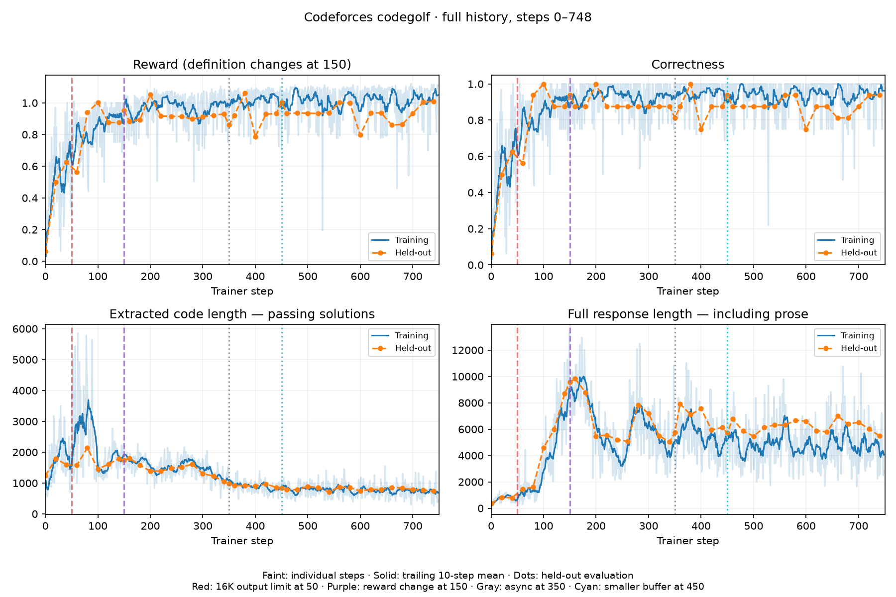
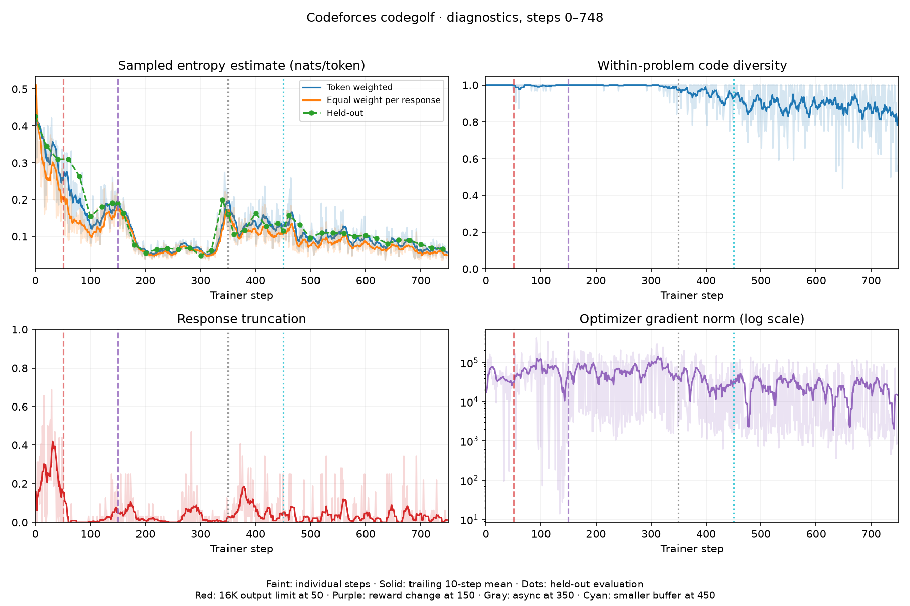
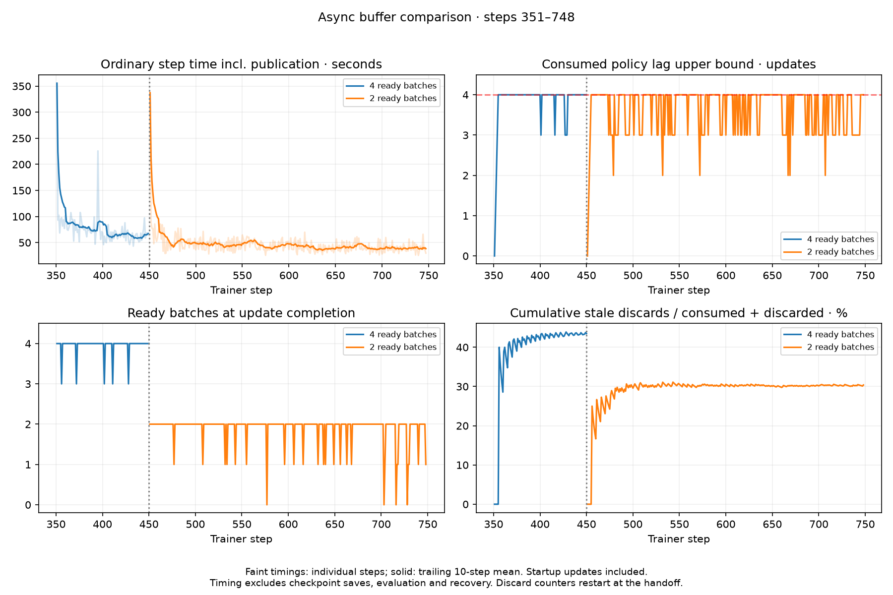

# Codeforces codegolf with Qwen3.5-9B

Code-only GRPO through Lilo: sample eight Python solutions for each of four
Codeforces problems, judge them in isolated Modal sandboxes, and reward
correctness and brevity. The model has no execution tool.

The `thinking-v10` variant uses the full available 65,536-token context: the
sampler subtracts prompt length and one reserved token from the output allowance.
Thinking and final code share that allowance. Its reward is unchanged, including
the output-token penalty capped at 0.20 once 16,384 output tokens are reached.
The earlier `thinking-v9` retains its 16,384-token output limit.

The `thinking-v9` variant enables Qwen's thinking mode. Its final answer is still
judged for correctness and code length; thinking and final output share the
16,384-token budget and both count toward the existing output-token penalty.
Only code after `</think>` is judged; an unfinished thinking section submits no
solution. Both thinking and answer tokens participate in the policy update.
The prompt permits thinking while requiring a compact, code-only final answer.

To start this variant from base weights, use a new run name:

```bash
uv run --env-file .env codegolf launch --run golf-thinking --variant thinking-v9 --steps 1000
```

## Asynchronous execution

The default `prompt-v8` overlaps rollout generation and judging with learner
updates. The historical `async-v5` variant retains a four-batch queue.
Four producers prefill a bounded two-batch ready queue, then keep
producing while a single consumer serializes trainer mutations. Sampling requests
4–8 inference replicas and up to 64 concurrent judge sandboxes. Trainer topology
is unchanged. `reward-v4` selects the original synchronous loop.

Every batch retains its sampling-policy lower bound and sampled behavior
logprobs. Immediately before an update, the consumer discards batches whose
policy is more than four completed updates behind the learner. Lilo's latest
sampler guarantees weights at least as new as the requested version; this makes
the recorded lag a conservative upper bound even if inference refreshes weights
mid-generation. PPO uses the sampled logprobs for importance ratios. Recovery
cancels and drains every producer and clears buffered work before replacing the
trainer. No queued rollout survives a restore.

Metrics record queue depth, in-flight batches, discarded stale batches, sampling
batch time, learner wait, update time, and weight-publication time. Checkpointing
and fixed-policy evaluation remain synchronization points; a buffer cannot
promise continuous GPU utilization if sampling throughput is insufficient.

## Recorded results from the earlier shared deployment

Historical snapshot through **step 748**, from a run targeting **1,000** steps.
The validated split contains **123 training problems and 16 held-out problems**.







The last 20 recorded updates average 95.2% training correctness and 40 seconds
per ordinary step including weight publication. Held-out evaluation at 740 passes
15/16 problems, with passing code averaging 737 UTF-8 bytes. These timings exclude
checkpoint saves, evaluation, GPU allocation and recovery. They are client wall
times, not measured GPU utilization or a controlled throughput benchmark.

The run is synchronous through step 350, uses async rollouts with a four-batch
ready queue at 351–450, then a two-batch queue from 451. Both async variants keep
four producers and enforce a maximum policy lag of four. At 748 the smaller-buffer
controller has trained on 298 batches and discarded 130 stale batches (30.4% of
consumed plus discarded batches), compared with 43.5% before the buffer change.
Pending work and discarded work from rolled-back attempts are excluded from
these percentages. Smaller queues reduced waste but did not eliminate it.

Step 0 is held-out evaluation only. The output limit increased to 16,384 at 50;
the reward changed at 150, so raw reward across that boundary is not comparable.
Recovery and planned handoffs restored checkpoints 350 and 450; discarded attempts
are excluded from the canonical curves. Startup and handoff downtime are not
visible on the step axis. An early async attempt replayed steps 351–369 after a
restore; diagnostics select each metric's consumed sampling ticket so retained
files from the old attempt cannot create gaps or double-count samples.

The fixed evaluation has only 16 stochastic samples; one answer changes accuracy
by 6.25 percentage points. Passing-code averages also change when the solved set
changes. Repeated exposure to the small training set and falling sampled entropy
make generalization worth checking; these results do not establish convergence
or rule out overfitting. Code diversity is the exact-string distinct fraction
among eight submissions per problem, including incorrect submissions.

The [aggregate snapshot](figures/metrics.json) and [renderer](figures/render.py)
reproduce all three figures without prompts, hidden tests, credentials or raw
training rollouts:

```bash
uv run python figures/render.py
```

[Compare generated outputs at steps 150 and 620](figures/output-comparison.html):
three selected held-out problems, with both versions passing the retained tests.
The standalone page embeds the exact generated responses and Python code; choose
a problem and toggle full response versus extracted code. Download/open the HTML
in a browser (GitHub's source view does not execute it). These examples illustrate
clear reductions and are not a random sample.

## Reward and configuration

The default `prompt-v8` explicitly tells the model that solutions are judged on
correctness and source length, and asks it to omit comments and explanations.
It uses the stronger reward introduced in `async-v7`:

```text
penalty = 0.20 * min(output_tokens / 16384, 1)
reward  = 1 + 0.30 * exp(-code_utf8_bytes / 2048) - penalty  # all tests pass
reward  = -penalty                                        # otherwise
advantage = (reward - group_mean) / max(group_std, 0.5)
```

The historical step-748 snapshot uses `async-v6`, with bonus 0.15 and token
penalty 0.08. Its later `async-v7` continuation and the new `prompt-v8` run are
not included in those figures. Compare correctness and lengths across reward
changes, not raw reward.

All output tokens count, including prose outside the extracted code. Passing
earns at least 0.80; failing earns at most zero. The standard-deviation floor
keeps tiny length differences from becoming unit-sized updates. `reward-v3`
retains the previous `1 + 0.1 * exp(-bytes / 256)` passing reward without an
output penalty. Neither reward guarantees stability.

[Configuration](codegolf/config.py): 1,000 steps by default, 4×8 samples per step,
16,384 output tokens, temperature 1, Adam learning rate 1e-6, PPO clipping
[0.8, 1.2], full model + optimizer checkpoints every 50 steps and at completion,
held-out evaluation every 20. Prompt targets are masked and sampled solutions
have equal total loss weight. There is no KL penalty or entropy bonus. Entropy
plots estimate mean negative sampled-token log probability, not vocabulary entropy.

The recorded trainer was **8×H200, 65,536 context, TP2/CP2/DP2**. This example
uses Lilo's Qwen3.5-9B full-training definition; it does not deploy or change the
shared trainer. Synchronous inference requests 1–2 replicas; async inference requests 4–8.

## Setup and execution

This draft uses the scoped deployment from [PR #21](https://github.com/modal-projects/lilo/pull/21).
The remote CPU controller opens `lilo.run(...)` with the existing **8×H200,
TP2 × CP2 × DP2, 65,536-token** trainer recipe. Each sampler uses one H200.
The generated API URL/key stay in the controller process. Python 3.12 is required.
Configure Modal access, the `lilo-proxy` secret, and the existing `lilo-api`
secret containing your OTLP settings in the chosen environment.

The final observability guide has been reviewed and the full GPU recovery probe
passed. On September 14, 2026, `qwen9b-prompt-v8` was launched in
`modal-labs / connor-dev-2`, using the `codegolf-scoped` app and volume. It starts
from base weights: the prior prompt-v8 attempt had no completed checkpoint.
The historical figures above are not results from this scoped implementation.

```bash
uv sync --frozen
cp .env.example .env
# Fill in your Modal profile/environment; this run generates its own API credentials.
# Configure Modal credentials separately. Never commit .env.
uv run codegolf config
uv run --env-file .env modal deploy -m codegolf.app
uv run python -m codegolf.data
uv run --env-file .env modal volume put lilo-codegolf-example data/problems.json /problems.json
uv run --env-file .env modal run -m codegolf.app --smoke
uv run --env-file .env modal run -m codegolf.app::judge_transport_smoke
uv run --env-file .env codegolf launch --run golf --steps 1000
```

Customize `CODEGOLF_APP` and
`CODEGOLF_VOLUME` for isolation, including the volume upload command above.
Run only one controller per deployment. The launch command saves its handle
locally and runs remotely after terminal disconnect. Smoke tests use CPU sandboxes;
training requires the GPU resources above.

```bash
uv run --env-file .env codegolf status --run golf
uv run --env-file .env codegolf fetch --run golf --rollouts
uv run python -m codegolf.report runs/golf
uv run python -m codegolf.diagnostics runs/golf
```

Rollout downloads can be large; omit `--rollouts` for reward/correctness plots.
Entropy/diversity require tokens and logprobs. Fetch removes stale metrics after
rollback. Dataset preparation pins `deepmind/code_contests` revision
`802411c3010cb00d1b05bad57ca77365a3c699d6`, selecting 160 Codeforces problems rated
800–1400 and retaining public/private/generated tests. Reference validation gates
the deterministic train/evaluation split. Each run saves its dataset hash.

## Recovery and continuation

Sampling/judging retry with backoff. Failed parallel work is cancelled and drained
before replacing clients. Judge payloads use stdin to avoid the 64 KiB argv limit;
sandboxes have timeouts and are terminated in `finally`.

A possibly applied optimizer update is never blindly repeated. The loop unloads
its model, creates a replacement, restores **model and optimizer**, and republishes
inference weights. The CPU controller also has Modal retries. Atomic state writes
are committed to a persistent volume; checkpoint pointers advance only after a
full save succeeds. Recovery removes newer metrics from the canonical curve.
Internal recovery is bounded to 30 attempts.

Every-50 checkpointing can lose 49 updates, or 50 if checkpoint commit fails.
Before the first checkpoint a fresh run restarts from base weights. Repeated
preemption, GPU allocation waits or persistent bugs can prevent progress despite
a live call. Verify successful updates after restoration. Hard cancellation can skip Python cleanup. The scoped API, trainer and latest
samplers belong to the controller-owned ephemeral app and stop on owner disconnect;
this is asynchronous, so verify container termination when stopping a run. The
experiment uses latest sampling only and creates no separately deployed pinned pools.
A controller retry opens a new scope and restores the persisted checkpoint; trainer
replacement within a live controller stays in the same scope.

The CLI refuses duplicate launches while its saved call is live, and refuses to
replace failed handles automatically. Inspect failures/checkpoints before archiving
a failed handle and resuming; preserve handles when moving machines. A completed
run can resume with a larger `--steps` target.

For a reward fork, stop and release the source controller's model resources, then:

```bash
uv run --env-file .env python fork_checkpoint.py SOURCE_RUN NEW_RUN --step 150 --variant async-v6
uv run --env-file .env codegolf launch --run NEW_RUN --variant async-v6
```

The helper requires the source's current committed checkpoint to match and rejects
an existing destination, changed dataset or changes outside reward/pipeline settings. It records
`lineage.json`, preserves absolute step numbers, and evaluates the restored policy
before updating. Old reward metrics remain separate. Fork runs created by this
example: its reduced configuration schema differs from private historical runs.

## Code and validation

[train.py](codegolf/train.py) is the loop/recovery;
[store.py](codegolf/store.py) persists state;
[reward.py](codegolf/reward.py) builds rewards and masked training data;
[judge.py](codegolf/judge.py) executes submissions. The other modules provide
configuration, dataset preparation, entry points and plots. Retired agent tooling,
vendored Lilo, incident scripts and runtime artifacts are omitted.

Submissions run unprivileged in network-blocked sandboxes without secrets or
volumes, with CPU/memory/process/output/time limits. Expected outputs stay outside.
Whitespace-token hashes compare output; this is not the official Codeforces judge
and has no custom checkers. Public problems may have appeared in pretraining.

```bash
uv run pytest -q
uv run ruff check codegolf tests fork_checkpoint.py figures/render.py
uv run ruff format --check codegolf tests fork_checkpoint.py figures/render.py
```

Tests cover judge transport/failures, reward bounds, loss masks, rollback,
uncertain optimizer/publication failures, continuation and cancellation/draining.
The figures come from the earlier implementation; this scoped run has its own
metrics and checkpoint ledger.

## Run observability

The controller forwards only `OTEL_*` settings from its existing Modal secret to
scoped Lilo services using `telemetry_secret`. It never forwards the shared API
key. The trainer image retains its existing OTel 1.43 dependency versions; the
HTTP exporter matches them.

Every model is created with allowlisted `user_metadata.run_id` and `attempt_id`.
These become `lilo.run_id` and `lilo.run_attempt_id` on trainer operations, sampling requests and their HTTP retries. Controller reward,
correctness, passing UTF-8 bytes, response token length, sampled entropy, pipeline
metrics and checkpoint/recovery receipts use the same identity. No prompts, code,
logprob arrays, credentials or arbitrary metadata are included in OTLP payloads.

Filter Datadog traces with `@lilo.run_id:RUN` and metrics with `lilo.run_id:RUN`;
group spans by `lilo.run_attempt_id` to distinguish replacements. Trainer state is sampled
every five seconds on separate execution, checkpoint and sampler persistence lanes.
Use `.fill(null)` so missing samples do not imply idle time. Sampled entropy here
is mean negative sampled-token log probability, not full-distribution entropy.
Durable run files determine which steps survived rollback; telemetry cannot retract
already exported metrics. A notebook is created explicitly outside the runtime.

The implementation follows the final [observability guide](../../docs/observability.md)
from observability PR #23, including its active command participation spans:
canonical command roots, linked
physical execution traces, metadata snapshots through sampler artifacts/sessions,
and no per-sample model lookup. Trainer-state metrics retain physical instance
labels. Because this scoped deployment belongs to exactly one experiment, its
OTel **resource** also carries `lilo.run_id`. Scoped trainers promote that
deployment identity to a metric datapoint tag, enabling a whole-run filter with
direct OTLP intake while preserving shared-trainer metric semantics. Group trainer-state
series by `lilo.trainer_instance_id`, not experiment attempt ID.

CPU-only Modal probes in `modal-labs/connor-dev-2` verified nested ownership and
normal scope exit. Killing the owner of a child with `min_containers=1` stopped
the child with zero containers approximately three minutes later (the heartbeat
timeout). This is eventual cleanup, and a retry may briefly overlap allocation
with its previous scope. The actual controller image also passed a CPU-only preflight: all scoped functions
registered, the 8-H200/64K recipe and 16K output budget were confirmed, and both
OTLP exporters initialized from the existing secret.

A real 8×H200 recovery probe then trained twice, saved full model/optimizer state,
and computed an uninterrupted third update as a reference. After forcibly killing
the trainer, a replacement restored the checkpoint: forward loss and deterministic
sample tokens matched exactly. Its third update succeeded, with gradient norm
within 0.0006% and post-update loss within 0.013% of the reference. Final sampling
succeeded and the scoped app stopped with zero containers. This validates the
core restore path; it does not establish long-run convergence or eliminate
checkpoint rollback loss.

Datadog showed training and sampling across both recovery attempts under one run
ID, including sampling HTTP retries. A separate exporter probe verified that
run-filtered physical trainer metrics reach Datadog after the scoped metric-tag
fix in [observability PR #23](https://github.com/modal-projects/lilo/pull/23).
The [run notebook](https://app.datadoghq.com/notebook/15541726) uses the same run
filter across controller, trainer and sampler telemetry.
