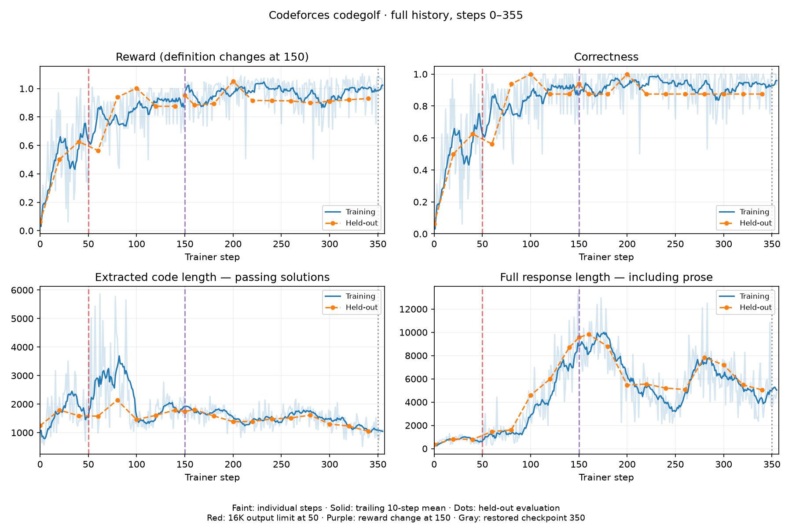
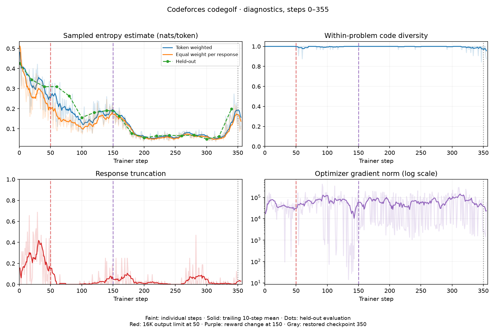

# Codeforces codegolf with Qwen3.5-9B

Code-only GRPO through Lilo: sample eight Python solutions for each of four
Codeforces problems, judge them in isolated Modal sandboxes, and reward
correctness and brevity. The model has no execution tool.

## Asynchronous execution

The default `async-v6` overlaps rollout generation and judging with learner
updates. The historical `async-v5` variant retains a four-batch queue.
Four producers prefill a bounded two-batch ready queue, then keep
producing while a single consumer serializes trainer mutations. Sampling requests
4–8 inference replicas and up to 64 concurrent judge sandboxes. Trainer topology
is unchanged. `reward-v4` selects the original synchronous loop.

Every batch retains its sampling-policy lower bound and sampled behavior
logprobs. Immediately before an update, the consumer discards batches whose
policy is more than four completed updates behind the learner. Lilo's latest
sampler guarantees weights at least as new as the requested version; this makes
the recorded lag a conservative upper bound even if inference refreshes weights
mid-generation. PPO uses the sampled logprobs for importance ratios. Recovery
cancels and drains every producer and clears buffered work before replacing the
trainer. No queued rollout survives a restore.

Metrics record queue depth, in-flight batches, discarded stale batches, sampling
batch time, learner wait, update time, and weight-publication time. Checkpointing
and fixed-policy evaluation remain synchronization points; a buffer cannot
promise continuous GPU utilization if sampling throughput is insufficient.

## Recorded results





These figures describe the original **synchronous** run, before the async change.
They are recorded steps 0–355, not a completed 500-step benchmark. Step 0 is
held-out evaluation. The output limit increased to 16,384 at step 50; the reward
changed at checkpoint 150. Raw reward values across that boundary are not
comparable. At 350, recovery discarded updates through 397; discarded attempts
are excluded. The fixed evaluation has only 16 stochastic samples. Passing-code
averages also change when the set of solved problems changes.

The small [aggregate snapshot](figures/metrics.json) and
[renderer](figures/render.py) reproduce these images without prompts, solutions,
hidden tests, credentials or raw rollouts:

```bash
uv run python figures/render.py
```

## Reward and configuration

```text
penalty = 0.08 * min(output_tokens / 16384, 1)
reward  = 1 + 0.15 * exp(-code_utf8_bytes / 2048) - penalty  # all tests pass
reward  = -penalty                                        # otherwise
advantage = (reward - group_mean) / max(group_std, 0.5)
```

All output tokens count, including prose outside the extracted code. Passing
earns at least 0.92; failing earns at most zero. The standard-deviation floor
keeps tiny length differences from becoming unit-sized updates. `reward-v3`
retains the previous `1 + 0.1 * exp(-bytes / 256)` passing reward without an
output penalty. Neither reward guarantees stability.

[Configuration](codegolf/config.py): 500 total steps, 4×8 samples per step,
16,384 output tokens, temperature 1, Adam learning rate 1e-6, PPO clipping
[0.8, 1.2], full model + optimizer checkpoints every 50 steps and at completion,
held-out evaluation every 20. Prompt targets are masked and sampled solutions
have equal total loss weight. There is no KL penalty or entropy bonus. Entropy
plots estimate mean negative sampled-token log probability, not vocabulary entropy.

The recorded trainer was **8×H200, 65,536 context, TP2/CP2/DP2**. This example
uses Lilo's Qwen3.5-9B full-training definition; it does not deploy or change the
shared trainer. Synchronous inference requests 1–2 replicas; async inference requests 4–8.

## Setup and execution

Follow the [Lilo setup guide](../../README.md) first. The shared deployment,
model assets and `lilo-api` secret containing `TINKER_API_KEY` must exist in your
chosen environment. From this directory, with Python 3.11 or 3.12:

```bash
uv sync --frozen
cp .env.example .env
# Fill in your Modal profile/environment, Lilo URL and API key.
# Configure Modal credentials separately. Never commit .env.
uv run codegolf config
uv run --env-file .env modal deploy -m codegolf.app
uv run python -m codegolf.data
uv run --env-file .env modal volume put lilo-codegolf-example data/problems.json /problems.json
uv run --env-file .env modal run -m codegolf.app --smoke
uv run --env-file .env modal run -m codegolf.app::judge_transport_smoke
uv run --env-file .env codegolf launch --run golf
```

The local API URL is captured when deploying. Customize `CODEGOLF_APP` and
`CODEGOLF_VOLUME` for isolation, including the volume upload command above.
Run only one controller per deployment. The launch command saves its handle
locally and runs remotely after terminal disconnect. Smoke tests use CPU sandboxes;
training requires the GPU resources above.

```bash
uv run --env-file .env codegolf status --run golf
uv run --env-file .env codegolf fetch --run golf --rollouts
uv run python -m codegolf.report runs/golf
uv run python -m codegolf.diagnostics runs/golf
```

Rollout downloads can be large; omit `--rollouts` for reward/correctness plots.
Entropy/diversity require tokens and logprobs. Fetch removes stale metrics after
rollback. Dataset preparation pins `deepmind/code_contests` revision
`802411c3010cb00d1b05bad57ca77365a3c699d6`, selecting 160 Codeforces problems rated
800–1400 and retaining public/private/generated tests. Reference validation gates
the deterministic train/evaluation split. Each run saves its dataset hash.

## Recovery and continuation

Sampling/judging retry with backoff. Failed parallel work is cancelled and drained
before replacing clients. Judge payloads use stdin to avoid the 64 KiB argv limit;
sandboxes have timeouts and are terminated in `finally`.

A possibly applied optimizer update is never blindly repeated. The loop unloads
its model, creates a replacement, restores **model and optimizer**, and republishes
inference weights. The CPU controller also has Modal retries. Atomic state writes
are committed to a persistent volume; checkpoint pointers advance only after a
full save succeeds. Recovery removes newer metrics from the canonical curve.
Internal recovery is bounded to 30 attempts.

Every-50 checkpointing can lose 49 updates, or 50 if checkpoint commit fails.
Before the first checkpoint a fresh run restarts from base weights. Repeated
preemption, GPU allocation waits or persistent bugs can prevent progress despite
a live call. Verify successful updates after restoration. Hard cancellation can
skip Python cleanup: stopping the controller alone does not guarantee its trainer
and inference pool are released. These resources depend on Lilo's idle cleanup;
[PR #17](https://github.com/modal-projects/lilo/pull/17) fixes the already-stopped
pool bug observed in this experiment.

The CLI refuses duplicate launches while its saved call is live, and refuses to
replace failed handles automatically. Inspect failures/checkpoints before archiving
a failed handle and resuming; preserve handles when moving machines. A completed
run can resume with a larger `--steps` target.

For a reward fork, stop and release the source controller's model resources, then:

```bash
uv run --env-file .env python fork_checkpoint.py SOURCE_RUN NEW_RUN --step 150 --variant async-v6
uv run --env-file .env codegolf launch --run NEW_RUN --variant async-v6
```

The helper requires the source's current committed checkpoint to match and rejects
an existing destination, changed dataset or changes outside reward/pipeline settings. It records
`lineage.json`, preserves absolute step numbers, and evaluates the restored policy
before updating. Old reward metrics remain separate. Fork runs created by this
example: its reduced configuration schema differs from private historical runs.

## Code and validation

[train.py](codegolf/train.py) is the loop/recovery;
[store.py](codegolf/store.py) persists state;
[reward.py](codegolf/reward.py) builds rewards and masked training data;
[judge.py](codegolf/judge.py) executes submissions. The other modules provide
configuration, dataset preparation, entry points and plots. Retired agent tooling,
vendored Lilo, incident scripts and runtime artifacts are omitted.

Submissions run unprivileged in network-blocked sandboxes without secrets or
volumes, with CPU/memory/process/output/time limits. Expected outputs stay outside.
Whitespace-token hashes compare output; this is not the official Codeforces judge
and has no custom checkers. Public problems may have appeared in pretraining.

```bash
uv run pytest -q
uv run ruff check codegolf tests fork_checkpoint.py figures/render.py
uv run ruff format --check codegolf tests fork_checkpoint.py figures/render.py
```

Tests cover judge transport/failures, reward bounds, loss masks, rollback,
uncertain optimizer/publication failures, continuation and cancellation/draining.
This is a cleaned version of the recorded experiment; the refactored example has
not itself been rerun to step 355.
